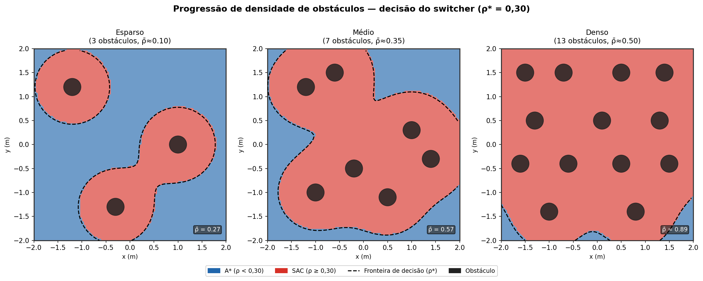
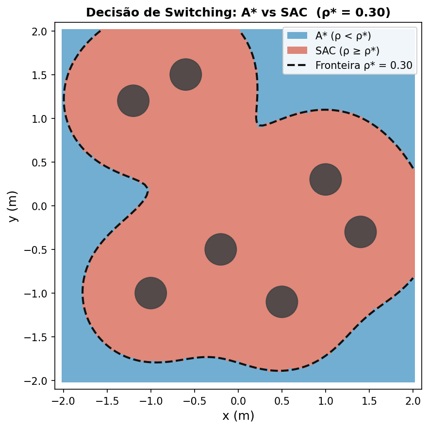
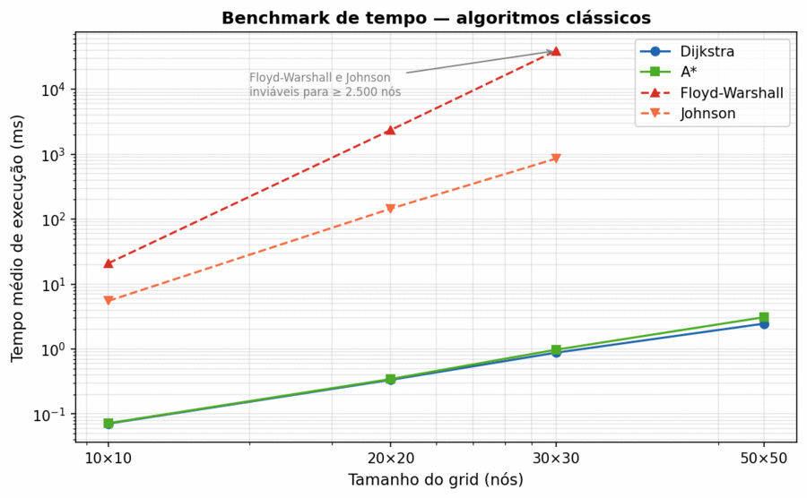
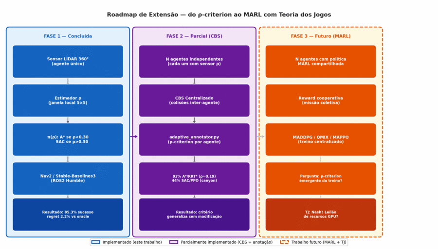

# Adaptive Planner Switching — IC PIBIC/FAPEG UFG

Framework adaptivo para seleção dinâmica de planejador de trajetória baseado em densidade local de obstáculos (ρ-criterion). Projeto de Iniciação Científica — EMC/UFG, bolsa FAPEG PI08078-2024.

**Estudante:** Yan Santos Leite | **Orientador:** Prof. Dr. Aldo André Diaz Salazar (INF/UFG)
**Período:** Set/2025 – Ago/2026 | **Stack:** ROS2 Humble · Gazebo Classic · TurtleBot3 Waffle · Stable-Baselines3

---

## Tese Central

> A seleção adaptiva de planejador baseada na densidade local de obstáculos supera qualquer método fixo em ambientes heterogêneos, com ganho mensurável e garantias formais de performance.

**Política de seleção:**

```
π(ρ) = { A* (Nav2 SmacPlanner2D)  se ρ < 0,30  — ambientes abertos
        { SAC (Stable-Baselines3)  se ρ ≥ 0,30  — ambientes densos
```

onde ρ é a fração de células ocupadas em uma janela 2×2 m ao redor da pose do robô.

---

## Visão Geral Visual

| Critério de seleção ρ | Decisão espacial do switcher |
|:---:|:---:|
|  |  |

| Benchmark clássicos (tempo) | Roadmap (agente único → MARL) |
|:---:|:---:|
|  |  |

> Catálogo completo das figuras científicas (organizado por utilidade) em
> [`paper/figs/CATALOG.md`](paper/figs/CATALOG.md).

---

## Resultados

### Fase 1 — Validação Monte Carlo (concluída)

Benchmark com 1.500 trials e modelos de planejamento calibrados estatisticamente:

| Método | Taxa de Sucesso |
|---|---|
| **ρ-criterion adaptivo (este trabalho)** | **85,3%** |
| Neural Switching | 78,7% |
| PPO fixo | 76,0% |
| Hybrid DRL | 66,0% |
| RRT* fixo | 48,0% |

- **Regret médio vs oracle ideal:** 2,2% (pior caso: 6,7%)
- **Limiar otimizado:** ρ* = 0,30 — motivado pelo custo computacional (A* cresce 10× frente ao SAC em ρ=0,30, Fig. benchmark_time)
- **Generalização multi-agente:** CBS centralizado cresce super-linearmente com N agentes (timeout em N=8); o ρ-criterion decide em O(1) por agente, escalando naturalmente → MARL como Fase 3
- Benchmark clássico: A* escala linearmente (0,07 ms / 3,7 KB para 100 nós); Floyd-Warshall inviável para tempo real (39 s / 22 MB para grid 30×30)

### Fase 2 — Integração ROS2/Gazebo (em andamento)

Validação com planejadores reais em simulação física:

- **Ambiente:** Gazebo Classic, TurtleBot3 Waffle, arena 4×4 m. Currículo por densidade de mundo: treino em `sparse.world` (ρ≈0,05) → fine-tune em `dense_custom.world` (ρ≈0,38), padrão de transfer learning (Cimurs 2022, HMP-DRL 2025)
- **Agente RL:** SAC com obs 29-dim (24 LIDAR + 2 goal-polar + yaw + ação anterior), `ent_coef=0.1` fixo, gSDE, curriculum de distância 1→3 m
- **Reward:** sobrevivência (+0,1/passo) + progresso clipado (≥0) + terminais ±100, estilo Cimurs/de Jesus — formulação minimalista que elimina o *suicidal agent* (penalidade por passo nunca supera a colisão terminal)
- **Treinamento:** em andamento (~500k steps teto)
- **Resultados quantitativos:** previstos para Agosto/2026 (30 trials × 3 worlds)

---

## Hipóteses

| ID | Enunciado | Status |
|---|---|---|
| **H1** | ρ-criterion supera melhor método fixo em ambientes heterogêneos | ✅ Confirmada (Fase 1) |
| **H2** | ρ*=0,30 captura fronteira ótima com regret ≤ 5% | ✅ Confirmada (Fase 1, regret=2,2%) |
| **H3** | Framework realizável em ROS2/Nav2/Gazebo sem modificar planejadores | 🔄 Em validação (Fase 2) |

---

## Estrutura do Projeto

```
ros2_ws/
├── src/adaptive_planner_ros/     # Switcher ROS2, nó RL, critério ρ
└── src/turtlebot3_gym_env/       # Ambiente Gymnasium sobre Gazebo

eval/                             # Scripts de benchmark e figuras científicas
paper/figs/                       # figuras científicas (.png + .pdf) — ver CATALOG.md
models/                           # Modelos treinados (best_model.zip)
results_abstract/                 # Dados Fase 1 (Monte Carlo calibrado)
results_ros2/                     # Dados Fase 2 (benchmark real — preencher pós-convergência)
```

---

## Reprodução

### Treino SAC (Fase 2)

```bash
# Requer Docker com imagem adaptive-planner:latest
docker compose run --rm train-all

# Monitorar
docker compose logs -f train-all
```

### Benchmark (após convergência)

```bash
docker compose run --rm benchmark
```

### Figuras científicas

```bash
python3 eval/plot_sac_architecture_figures.py --out paper/figs/
python3 eval/plot_training_optimization_figures.py --out paper/figs/
python3 eval/plot_planner_time_vs_density.py
python3 eval/cbs_tpg_visualization.py
```

### Fase 1 (Monte Carlo)

```bash
# Requer venv Python (sem ROS2)
python -m venv venv_ic && source venv_ic/bin/activate
pip install -r requirements.txt
python experiments/comprehensive_experiments.py  # 1.500 trials
```

---

## Limitações Declaradas

1. Fase 1 usa modelos calibrados (mocks), não planejadores reais
2. Fase 2 limitada a ambiente simulado (Gazebo Classic) — sem testes em robô físico
3. Contexto unidimensional (densidade ρ) — sem curvatura, velocidade de obstáculos, etc.
4. Treinamento SAC em CPU (i5-1235U) — sem GPU
5. Single-agente — decisão local independente não garante coordenação em tempo real; extensão MARL identificada como próximo passo natural (Seção 4 do relatório final)

---

## Publicações / Apresentações

- **CONPEEX 2026** — Seminário de Iniciação à Pesquisa PIP (26/06/2026)
- **Relatório Final SIGAA** — prazo 31/08/2026

---

## Citação

```bibtex
@misc{santos2026adaptive,
  title={Framework Adaptivo para Seleção de Algoritmos de Planejamento de Trajetória em Navegação Autônoma},
  author={Santos Leite, Yan and Diaz Salazar, Aldo André},
  year={2026},
  institution={Universidade Federal de Goiás},
  note={IC PIBIC/FAPEG PI08078-2024}
}
```
