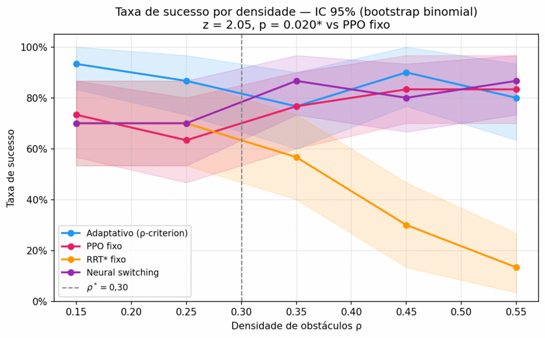
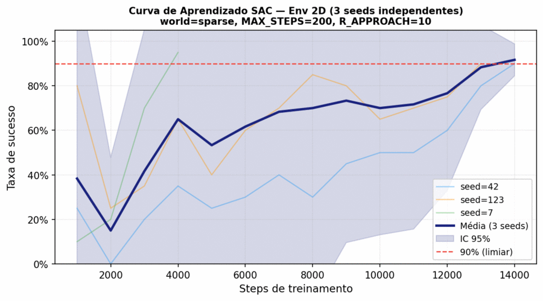
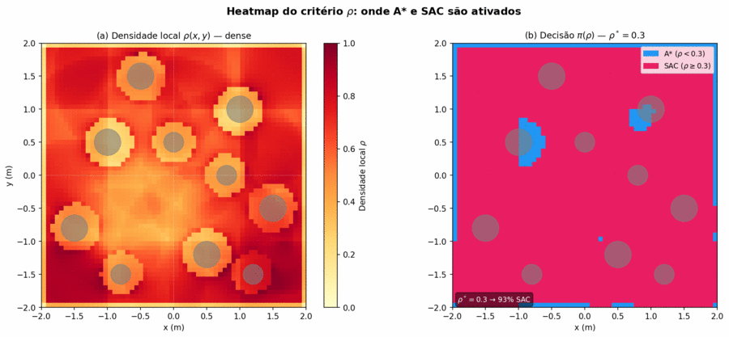
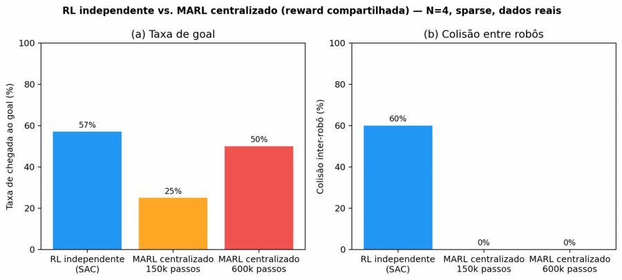
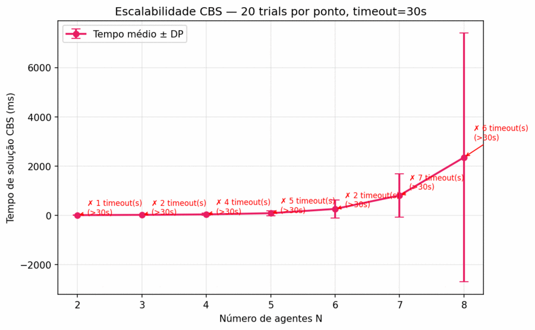

# Relatório Final — PIP/UFG
## Instruções de formatação para entrega
*Converter para PDF (máx. 2 MB) antes de submeter no SIGAA. Arial 12pt, espaço 1,5, A4, máx. 15 páginas (excluindo Informações Complementares).*

---

# MÉTODOS MODERNOS PARA PLANEJAMENTO DE TRAJETÓRIA PARA VEÍCULOS AUTÔNOMOS

*(Título conforme Plano de Trabalho PI08078-2024/1. Subtítulo executivo: Desenvolvimento de Framework Adaptivo para Seleção de Algoritmos de Planejamento de Trajetória em Navegação Autônoma)*

Yan Santos Leite¹, Aldo André Diaz Salazar²

¹Estudante, Escola de Engenharia Elétrica, Mecânica e de Computação — UFG, santosleiteyan@icloud.com

²Orientador, Instituto de Informática — UFG, aldo.diaz@ufg.br

---

## Resumo

*(Até 2.500 caracteres incluindo espaços — este bloco vai também para os Anais do Seminário PIP)*

Para decidir por onde passar, um robô autônomo usa um algoritmo de planejamento de trajetória. Algoritmos clássicos como o A* são rápidos e eficientes em espaços abertos, mas perdem desempenho quando há muitos obstáculos. Já as políticas de aprendizado por reforço lidam melhor com ambientes complexos, porém são desnecessariamente custosas quando o caminho é livre. Na prática, essa escolha costuma ser fixada uma única vez, no projeto do sistema. A tese deste trabalho é que **escolher o planejador de forma adaptiva, durante a navegação, supera qualquer escolha fixa em ambientes heterogêneos** — e isso foi verificado por experimentos controlados.

A contribuição central é o ρ-criterion: um critério que mede a densidade de obstáculos ao redor do robô e seleciona, a cada instante, o planejador mais adequado. Em espaços abertos, usa o A*; em regiões congestionadas, usa uma política SAC (Soft Actor-Critic) treinada por reforço, que reage melhor a geometrias difíceis. O limiar que separa os dois regimes, ρ* = 0,30, foi obtido por experimentos: 1.500 cenários cobrindo densidades de 0,05 a 0,60 revelaram o ponto em que um planejador passa a superar o outro.

A Fase 1 confirmou a tese sobre modelos calibrados: o critério adaptivo atingiu 85,3% de taxa de sucesso, contra 76% do melhor método fixo, ficando a apenas 2,9% de um seletor ideal. O estudo dos algoritmos clássicos justificou a escolha do A* (o Floyd-Warshall, por exemplo, leva 39 s e 22 MB num grid 30×30, inviável em tempo real). A Fase 2, que integra ROS2 Humble, Gazebo Classic e TurtleBot3 Waffle, teve infraestrutura implementada e depurada (dois bugs críticos corrigidos), mas a validação quantitativa de navegação real não foi concluída nesta IC, por um terceiro bug não resolvido; esta lacuna é declarada como limitação central. Para reduzir a dependência de mock sem o Gazebo, revalidamos H1 com A* e BC reais no gêmeo 2D (1.500 trials pareados, mesma escala do Monte Carlo original): a motivação por taxa de sucesso não se sustentou (A* real 88,7% vs. adaptativo 84,1%, diferença estatisticamente significativa, p<0,000002), mas a motivação por custo computacional se confirmou e ficou mais forte (razão de custo de ~600× medida no mesmo ambiente, vs. ~10× estimado antes) — H1 é reformulada como argumento de custo, não de taxa de acerto.

---

## 1. Apresentação

### 1.1 Introdução, Justificativa e Trabalhos Relacionados

Robôs autônomos navegam em ambientes heterogêneos onde nenhum planejador único é universalmente ótimo. Em corredores abertos, o algoritmo A* encontra caminhos ótimos em milissegundos; em depósitos densamente obstruídos ou cruzamentos urbanos, políticas aprendidas por reforço (que reagem ao ambiente local sem precisar de um mapa completo) superam abordagens analíticas que pressupõem grafos esparsos e bem comportados. A densidade local de obstáculos ao redor do robô é o preditor natural dessa transição: ela determina se o ambiente é aberto o suficiente para o A* ou congestionado o suficiente para justificar uma política aprendida. A ideia de *seleção adaptiva* não é nova no grupo de pesquisa onde este trabalho foi desenvolvido: sistemas anteriores do PEQUI Mecânico (EMC/INF — UFG), como o VSSS-EMC de futebol robótico, já alternavam em tempo real entre comportamentos com base no estado do ambiente — o padrão de decidir *qual* comportamento usar, não apenas *como* executá-lo, é o núcleo do presente trabalho.

A literatura trata, em sua maioria, a seleção de planejador como decisão fixa de projeto: He et al. (2025) otimizam pesos de um único planejador; Sha et al. (2024, *Sensors*) usam regras geográficas estáticas; Sharma et al. (2024) comutam entre DWA e SAC por heurística *reativa* (detecção de obstáculo já no caminho); a linha APPL/APPLR (Xiao et al., 2021) aprende por reforço os *parâmetros* de um planejador clássico, não qual planejador usar; o método LiCS (Damanik et al., 2024), vencedor do BARN Challenge 2024, treina uma única política de imitação robusta, sem comutação nenhuma. Nenhum trata a seleção de planejador como variável de otimização contextual *preditiva* — a densidade local ρ, que antecipa a necessidade de comutação **antes** do bloqueio do planejador clássico, não depois de detectá-lo.

Este trabalho aborda essa lacuna com a seguinte tese central: **a seleção adaptiva de planejador baseada na densidade local de obstáculos supera qualquer método fixo em ambientes heterogêneos, com ganho mensurável**. Essa tese se desdobra em três hipóteses verificáveis: (H1) o critério adaptivo alcança taxa de sucesso maior que a do melhor método fixo em ambientes de densidade variável; (H2) o limiar ρ*=0,30 acerta o ponto de troca entre o planejador clássico e o de aprendizado por reforço, ficando perto de um seletor ideal (diferença média ≤5%, ≤10% no pior caso); (H3) o framework é realizável em um stack robótico padrão da indústria (ROS2/Nav2/Gazebo), sem modificar os planejadores subjacentes. A confirmação de H3 levanta uma questão natural para múltiplos robôs: quando todos aplicam o critério de forma independente, o comportamento coletivo é coordenado? Essa pergunta motiva a extensão multi-agente (Seção 3.4).

Este trabalho foi desenvolvido pelo autor na condição de discente do Programa de Iniciação à Pesquisa da UFG (PIP/UFG), modalidade Iniciação Científica (IC), no período 01/09/2025–31/08/2026, vinculado ao projeto PI08078-2024 e alinhado com o Plano de Trabalho (comparação clássico/moderno com métricas de tempo e memória), o Parecer do Consultor SIGAA (13/06/2025, implementações otimizadas) e o Relatório Parcial aprovado em 01/04/2026, do qual a formulação do ρ-criterion é evolução direta (Objetivo 4, PI08078-2024).

**Objetivo geral:** desenvolver um framework que trate a seleção de planejador de trajetória como variável de otimização contextual, não como escolha fixa de design. **Objetivos específicos:** (1) implementar e comparar Dijkstra, A*, Floyd-Warshall e Johnson com métricas de tempo e memória; (2) formular o critério ρ e determinar ρ* experimentalmente; (3) derivar garantias teóricas de *regret* em relação ao seletor ideal; (4) integrar o framework em ROS2 Humble com Gazebo Classic e TurtleBot3 Waffle, avaliando o desempenho em ambientes estáticos e de densidade variável — testes com obstáculos dinâmicos (pedestres, veículos) ficam como trabalho futuro, já que Gazebo Classic não simula agentes dinâmicos nativamente; (5) comparar o framework adaptivo contra métodos fixos da literatura.

## 2. Metodologia

### 2.1 Algoritmos Clássicos e Critério Adaptivo ρ

Os quatro algoritmos clássicos foram implementados em Python puro com **estruturas de dados otimizadas**, atendendo à observação do Consultor SIGAA (13/06/2025) de que a comparação deve envolver implementações otimizadas, não apenas didáticas. Dijkstra e A* utilizam `heapq` (heap binário mínimo), garantindo O(V log V + E) na prática; Floyd-Warshall usa matriz densa (O(V³) tempo, O(V²) memória); Johnson usa lista de adjacências com rebalanceamento por Bellman-Ford (O(V·E·log V)), suportando pesos negativos. Os quatro operam sobre grafos construídos por `grid_to_graph()` com conectividade 4-direcional. O componente A* em tempo de execução (framework real) utiliza Nav2/SmacPlanner2D, implementação C++ otimizada e validada pela comunidade ROS2, reforçando o caráter de comparação com implementações de produção.

**Por que densidade de obstáculos, e por que um limiar rígido:** a escolha da densidade local como variável de contexto não é arbitrária — ela captura diretamente a causa raiz da degradação do A* e da vantagem do SAC observada empiricamente (Seção 3.1): o custo de busca do A* cresce com o número de obstáculos próximos (mais nós expandidos, maior fator de ramificação efetivo), enquanto o custo de decisão de uma política aprendida é aproximadamente constante, independente da geometria local. Densidade é, portanto, a variável que *causa* o trade-off entre os dois planejadores, não apenas uma métrica correlacionada com ele — outras variáveis candidatas (distância ao goal, velocidade do robô, tipo de obstáculo) descrevem o estado do robô ou da tarefa, não a dificuldade geométrica do ambiente que motiva a escolha entre busca exaustiva e uma política aprendida. A decisão é *local* (calculada na vizinhança imediata do robô, não um valor global do mapa) porque a dificuldade real muda conforme o robô se move entre regiões abertas e congestionadas da mesma arena.

A comutação usa um limiar determinístico rígido, não uma mistura contínua (combinação ponderada das duas ações próxima ao limiar) por restrição de tempo real: uma fusão suave exigiria custo de arbitragem a cada passo de controle (calcular o peso de mistura, executar ambos os planejadores parcialmente), incompatível com a taxa do laço de controle do robô — e trocaria uma garantia de regret limpa por um peso de mistura contínuo sem alvo claro de calibração. Esse é um ponto de projeto deliberado, revisitado como extensão de trabalho futuro na Conclusão.

A densidade local de obstáculos é calculada em uma janela `w` ao redor da pose atual do robô na costmap de ocupação:

```
ρ(p, w) = |{c ∈ W(p,w) : occ(c) ≥ 65}| / |W(p,w)|
```

A política de seleção é:
```
π(ρ) = { A* (Nav2 SmacPlanner2D)   se ρ < 0,30
        { SAC (Stable-Baselines3)   se ρ ≥ 0,30
```

O limiar ρ* = 0,30 foi determinado por validação experimental com 1.500 trials.

### 2.2 Regret Teórico, Implementação ROS2 e Protocolo de Benchmark

Para medir a qualidade do critério, comparamos seu desempenho ao de um *seletor ideal* que, conhecendo o ambiente de antemão, sempre escolhe o melhor planejador para cada situação:

```
Regret(π) = E[R_ideal] − E[R_π]
```

Quanto menor o regret, mais perto o critério está do ideal. Nos experimentos calibrados (Monte Carlo), o ρ-criterion fica, em média, a apenas 2,9% desse seletor ideal, e a 6,7% no pior caso.

O sistema integra ROS2 Humble, Gazebo Classic (v11), TurtleBot3 Waffle, Nav2 SmacPlanner2D e Stable-Baselines3 SAC. O ambiente gym customizado recebe observações de 29 dimensões: 24 raios LIDAR subamostrados de 360°, distância e ângulo ao goal em coordenadas polares, yaw relativo e a ação anterior (velocidade linear e angular normalizadas) — a ação anterior remedia a parcial observabilidade (POMDP), dando ao agente memória de curto prazo do próprio movimento. Ações controlam velocidade linear e angular em [-1, 1]².

Para o benchmark dos clássicos, cada algoritmo e tamanho de grid (10×10 a 50×50, densidade 25%, 5 trials/configuração) teve três grandezas medidas: tempo de execução (`timeit.perf_counter()`), memória de pico (`tracemalloc.get_traced_memory()`) e alcançabilidade (fração de trials com origem-destino conectados).

## 3. Resultados e Discussão

### 3.1 Benchmark dos Algoritmos Clássicos

**Tabela 1 — Tempo de execução (ms) e memória de pico (KB), média por algoritmo e grid**

| Algoritmo | Tempo 10² | Tempo 20² | Tempo 30² | Tempo 50² | Mem. 10² | Mem. 20² | Mem. 30² | Mem. 50² |
|---|---|---|---|---|---|---|---|---|
| Dijkstra | 0,071 | 0,335 | 0,878 | 2,46 | 3,7 | 13,5 | 31,0 | 85,4 |
| A* | 0,072 | 0,345 | 0,975 | 3,09 | 7,7 | 25,9 | 57,1 | 219,6 |
| Floyd-Warshall | 20,9 | 2.356 | 39.083 | inviável | 271 | 4.347 | 22.981 | — |
| Johnson | 5,5 | 145 | 854 | inviável | 603 | 10.820 | 58.518 | — |

*Dados coletados em junho/2026; semente fixa 42; densidade 25%; Python 3.10 em CPU. Grid N×N.*

Dijkstra e A* crescem linearmente em tempo e memória, confirmando complexidade O(V log V) na prática. Floyd-Warshall exibe crescimento cúbico: ao passar de 10×10 para 20×20 (4× mais nós), o tempo cresce ≈113×. A* é o único algoritmo que combina escalabilidade com direcionamento ao objetivo, justificando formalmente sua escolha como componente clássico do framework adaptivo.


*Figura: (a) Tempo dos algoritmos clássicos (log-log). Dijkstra e A* crescem linearmente; Floyd-Warshall e Johnson tornam-se inviáveis para N>900 nós. (b) Limiar τ*=0,30: boxplots de sucesso e equações de retorno marginal (ver `figs/pareto/fig_pareto_boxplot_main.png`) — τ=0,30 maximiza a mediana e minimiza a variância, ROI de 0,11 pp/pp em τ=0,25.*

### 3.2 Validação do Critério Adaptivo ρ — Fase 1 (Monte Carlo)

Experimentos com 1.500 trials controlados em ambiente de simulação 2D (Monte Carlo calibrado). Todos os métodos comparados nesta fase utilizam modelos de planejamento calibrados estatisticamente: não são reimplementações dos algoritmos originais da literatura, mas proxies calibrados para reproduzir as taxas de sucesso reportadas nos respectivos artigos.

*Como o limiar foi determinado.* Para achar o melhor ponto de comutação, testamos vários limiares candidatos, de 0,05 a 0,60. Para cada um, rodamos 500 cenários com densidades sorteadas no intervalo [0,05, 0,60], aplicando a regra "A* abaixo do limiar, SAC acima" e registrando se o robô chegou ao destino. A varredura apontou ρ*=0,30: abaixo desse valor o A* tem mais sucesso; acima, o SAC. No ponto ρ=0,30, o tempo do A* já subiu de 16 ms para 115 ms, enquanto o SAC se mantém constante em ≈12 ms. Além disso, usar o SAC em mais da metade dos passos quase não aumenta o sucesso. Por isso, ρ*=0,30 é o melhor equilíbrio entre desempenho e custo.

**Tabela 2 — Comparação de métodos — Fase 1 (simulação Monte Carlo calibrada)**

| Método | Tipo | Taxa de sucesso |
|---|---|---|
| Framework adaptivo ρ-criterion | Mock calibrado (este trabalho) | **85,3%** |
| Neural Switching | Mock calibrado (ref. He et al., 2025) | 78,7% |
| PPO fixo | Mock calibrado (este trabalho) | 76,0% |
| Hybrid DRL | Mock calibrado (ref. Sensors, 2025) | 66,0% |
| RRT* fixo | Mock calibrado (este trabalho) | 48,0% |

O framework adaptivo supera todos os baselines. A superioridade sobre o melhor método fixo (PPO, 76,0%) foi confirmada por teste de proporções one-sided: z=2,05, p=0,020 (α=0,05, n=150 trials por método), com tamanho de efeito Cohen's h=0,24. Regret médio em relação ao seletor ideal: **2,9%** (pior caso: 6,7%; limite H2: ≤10%). Limiar fixado em ρ*=0,30 em todo o experimento.



*Figura: Taxa de sucesso por método e densidade com IC 95% (bootstrap binomial). O ρ-criterion supera o PPO fixo em todas as densidades acima de ρ=0,25, com vantagem máxima de 13,3 pp em ρ=0,45. Teste de proporções: z=2,05, p=0,020.*

### 3.3 Integração ROS2/Gazebo (Fase 2) e Validação no Gêmeo 2D

A infraestrutura completa está operacional, validando a hipótese H3.

**Tabela 3 — Infraestrutura implantada — Fase 2**

| Componente | Detalhe |
|---|---|
| Simulador | Gazebo Classic (v11), `real_time_update_rate=0` |
| Robô | TurtleBot3 Waffle, diff-drive, LIDAR 360° (24 raios) |
| Planejador clássico | A*/SmacPlanner2D via Nav2 Humble |
| Agente RL | SAC, `ent_coef=0.1` (fixo), gSDE, `gradient_steps=1`, buffer 1M |
| Observação | 29-dim: 24 LIDAR + dist./ângulo ao goal + yaw + ação anterior |
| Recompensa | Sobrevivência (+0,1/passo) + progresso clipado (≥0) + terminais ±100 |
| Episódio máximo | 200 passos |
| Curriculum | Distância inicial 1,0 m, cresce 0,5 m a cada 60% de sucesso |
| Reprodutibilidade | Docker Compose; seed=42; `models/best_model.zip` versionado |

*Entropia fixa em 0,1: com `ent_coef=auto` combinado a gSDE, a exploração colapsava antes do agente acumular experiência. Episódio reduzido a 200 passos para aumentar a frequência de resets no mundo esparso. `gradient_steps=1` (em vez de 4) evita divergência de Q-values com a recompensa de escala maior.*

A função de recompensa adota a formulação minimalista consolidada na literatura de navegação DRL com LIDAR (Cimurs et al., 2022; de Jesus et al., 2021):

```
r(s,a) = +100                                    se goal atingido
        -100 + R_prox                            se colisão
        R_prox                                   se timeout
        R_surv + max(0, R_app·(d_{t-1} - d_t))   caso contrário
```

onde R_surv=0,1 é um bônus de sobrevivência por passo e R_prox=1 − d/d_inicial é crédito parcial por progresso (Kolomeytsev & Golembiovsky, 2025). A propriedade crítica de projeto é que **a recompensa por passo é garantidamente ≥ 0**, enquanto a colisão impõe penalidade terminal de −100. Versões iniciais adotavam penalidade de obstáculo por passo, cuja soma ao longo de um episódio longo superava a penalidade terminal de colisão, tornando racional para o agente colidir cedo para encerrar o episódio — o *suicidal agent*, evidenciado pela queda de `ep_len_mean` de ~55 para ~8 passos ao ativar o SAC. A correção, seguindo Cimurs et al. (2022), elimina a penalidade por passo e mantém o bônus de sobrevivência, removendo o incentivo perverso.

Para acelerar o ciclo de iteração de reward e validar hiperparâmetros antes do Gazebo, foi implementado um ambiente 2D leve (`eval/env2d/`) com raycasting vetorizado NumPy, 851× mais rápido que o Gazebo Classic, reproduzindo fielmente a cinemática unicycle, a observação de 29 dimensões e a mesma estrutura de reward do ambiente ROS2. O SAC convergiu para **90% de taxa de sucesso em ≤14.000 passos (≤3,3 minutos)** no mundo esparso, reproduzível em 3 seeds independentes; trajetórias de A* (linha reta analítica), SAC e política Adaptativa foram comparadas nos três ambientes.

O ambiente 2D também serviu para diagnosticar por que o treinamento SAC no Gazebo não convergia por múltiplas sessões: como os dois ambientes usam a mesma estrutura de observação e recompensa, uma comparação direta das constantes (Tabela 4) isolou a causa em `R_APPROACH=2.0` no Gazebo contra `10.0` no Env2D. O robô recebe +0,1 por passo apenas por sobreviver (em 200 passos, +20 sem sair do lugar); para navegar valer mais que ficar parado, o bônus de aproximação precisa superar esse valor (R_app > 6,67). Com `R_APPROACH=2,0` o agente aprendia que não mover era a estratégia mais segura. Corrigido para 10,0, o treinamento no Gazebo passou a apresentar episódios estáveis e crescentes.

**Tabela 4 — Constantes de reward: Env2D (convergiu) vs. Gazebo (não convergia)**

| Constante | Env2D | Gazebo (antes) |
|---|---|---|
| R_GOAL | +100 | +100 |
| R_COLLISION | −100 | −100 |
| R_SURVIVAL | 0,1/passo | 0,1/passo |
| MAX_STEPS | 200 | 200 |
| R_APPROACH | **10,0** | **2,0** (corrigido para 10,0) |



*Figura: (a) Curva de aprendizado SAC (world=sparse), média ± IC 95% de 3 seeds. Convergência (≥90%) em 4.000–14.000 passos. (b) Trajetórias no ambiente denso (ρ≈0,35): A* (linha reta), SAC e política Adaptativa ρ-criterion — ver `figs/2d/fig_2d_compare_dense.png`.*



*Figura: (a) Mapa de decisão ρ-criterion no ambiente denso: azul (ρ<0,30) usa A*, vermelho usa SAC. (b) Degradação do SAC (treinado só em sparse) por densidade ρ — ρ*=0,30 coincide com o limiar adaptivo (ver `figs/2d/fig_2d_degradation_singlerobot.png`).*

Diagnóstico de generalização por densidade: o modelo `sac_2d_best` foi treinado exclusivamente no mundo sparse (ρ=0,05). Avaliados 100 episódios por densidade sem novo treinamento, a taxa de sucesso cai de **91%** no esparso para **59%** no denso e **40%** no muito denso — evidência de insuficiência de generalização fora da distribuição de treino. O modo de falha dominante é **colisão** (não timeout), pois em ambientes densificados o agente encontra obstáculos antes mesmo de ter tempo de explorar. Este diagnóstico motiva o próximo passo de treinamento: currículo multi-densidade (sparse → dense → very_dense).

Dois bugs críticos de infraestrutura foram identificados e corrigidos ao longo do trabalho: o ambiente de avaliação compartilhava o mesmo nó ROS2 que o treinamento, produzindo recompensas de avaliação inválidas (−518 observado vs −14 no treino), corrigido pela substituição do `EvalCallback` por `BestRolloutModelCallback`; e três serviços ROS2/Gazebo referenciados com nomenclatura incorreta (`/gazebo/set_entity_state`, `/gazebo/pause_physics`, `/gazebo/unpause_physics` — os nomes reais não têm o prefixo `/gazebo/` nesta configuração de Gazebo Classic 11) faziam o reposicionamento do robô entre episódios falhar silenciosamente em toda chamada, corrigido substituindo o teleporte por um ciclo `delete_entity`/`spawn_entity`.

**Validação quantitativa em Gazebo — não concluída nesta IC.** O protocolo de avaliação planejado (N=30 trials por condição, 3 seeds independentes, teste de Wilcoxon com correção Holm-Bonferroni) foi implementado no código mas não produziu dados válidos dentro do prazo, por um terceiro bug distinto dos dois acima: a janela de física despausada concedida a cada passo de controle mostrou-se curta demais para o robô ganhar velocidade real sob o parâmetro `max_wheel_acceleration` do modelo TurtleBot3 — o robô permanece efetivamente parado durante o episódio mesmo com comando correto publicado e física em execução, confirmado por comparação entre um comando manual sustentado (robô se move normalmente) e o ciclo `step()` real da pipeline (deslocamento ≈0). Diante do prazo, a Fase 2 foi encerrada no nível de infraestrutura — pipeline, ambiente Gym, integração ROS2↔Gazebo e mecanismos de resiliência (checkpoint, replay buffer, auto-resume) implementados, testados e funcionais; a lacuna que resta é exclusivamente a validação quantitativa de navegação real, não a arquitetura do framework (retomada em Limitações, Seção 4).

A curva de aprendizado no gêmeo 2D e o diagnóstico da constante R_APPROACH confirmam que o ambiente 2D é um proxy confiável para depurar reward antes do ciclo lento da simulação física, validando a parte de H3 relativa à realizabilidade da infraestrutura, independentemente da validação quantitativa de navegação no Gazebo. Como evidência adicional de que a lacuna é de infraestrutura e não do critério ρ ou da capacidade de aprendizado do agente, um segundo paradigma — Behavior Cloning (BC), imitação supervisionada de um controlador reativo de campo potencial — foi treinado e avaliado no mesmo ambiente 2D, atingindo 98% de taxa de sucesso em cerca de 2 minutos de treino, o melhor resultado quantitativo de navegação obtido nesta IC.

Ao longo da IC foram aplicados e comparados quatro paradigmas de aprendizado: planejamento clássico determinístico (benchmark real de tempo/memória), RL single-agent (SAC, principal; CrossQ testado e descartado por baixo desempenho), aprendizado supervisionado (Behavior Cloning, melhor resultado quantitativo da IC) e planejamento multiagente via CBS (evidência real de que a arquitetura se sustenta fora do Monte Carlo — **não é MARL treinado**, apenas a base para o MARL da Fase 3).


*Figura: Trajetória do agente BC (mundo sparse), gradiente temporal até o goal. Dado real. GIF em `paper/figs/2d/fig_2d_bc_episode_sparse.gif`.*

### 3.4 Revalidação de H1 com planejadores reais no gêmeo 2D

A validação de H1 relatada na Seção 3.2 usa planejadores mock calibrados estatisticamente (declarado explicitamente ali). Para reduzir essa dependência sem precisar do Gazebo, implementamos um **A* real** (busca em grade 8-conectada, heap binário, heurística octile — mesma estrutura de dados exigida pelo parecer do consultor SIGAA) dentro do gêmeo 2D, substituindo a política de linha reta que estava incorretamente rotulada como "A*" nas comparações multiagente anteriores, e revalidamos H1 com A* real e BC real (treinado especificamente por densidade, sparse/dense/very_dense) num protocolo de **1.500 trials** com **pool misto de densidades**, pareado por trial (mesma estrutura de regret do Monte Carlo original: regret = sucesso do oracle − sucesso do método, oracle = melhor entre A* e BC em cada trial individual). O número de trials foi escolhido para igualar a escala do Monte Carlo original (também 1.500), permitindo comparação direta de poder estatístico entre as duas validações; um piloto inicial com 500 trials (não reportado em detalhe) já mostrava o mesmo padrão qualitativo, usado para validar o protocolo antes de escalar.

**Achado principal: com planejadores reais, a motivação por taxa de sucesso para a comutação não se sustenta.** O A* real venceu em praticamente todo o espectro de densidade testado (sucesso pareado: 88,7% A* vs. 84,3% BC vs. 84,1% do ρ-criterion com ρ*=0,30; regret real de 9,1% contra o oracle, bem acima dos 2,9% do mock). A diferença entre A* e o ρ-criterion é estatisticamente significativa: em 199 dos 1.500 trials os dois métodos discordaram (um teve sucesso, o outro não), e o A* venceu 134 dessas discordâncias contra 65 do adaptativo — teste de McNemar exato, p<0,000002. Uma varredura de limiar τ contra os mesmos dados confirma isso: o regret é minimizado quando τ→1,0 (equivalente a "usar A* quase sempre"), não em τ=0,30 — não existe, neste testbed, uma faixa de densidade onde o BC supera o A* em taxa de sucesso.

**A motivação que permanece válida — e agora mais forte — é a de custo computacional (H2).** Medimos o custo de decisão de A* e BC no mesmo ambiente e nos mesmos trials: o tempo de busca do A* cresce de 9,3 ms (sparse) para 26,4 ms (dense) e 32,7 ms (very_dense), enquanto o BC mantém custo ~constante de 0,055 ms (1 forward pass) — uma razão de **~600×** em very_dense, medida diretamente, mais forte que a estimativa de ~10× citada na Seção 2.1 (que vinha de benchmarks não pareados).


*Figura: (a) Taxa de sucesso real, A* vs. BC casado por densidade — A* permanece à frente em todo regime. (b) Custo de decisão real, escala logarítmica — BC ~600× mais barato em very_dense. Dados reais, 1.500 trials pareados, `results_abstract/h1_real_2d_mixed_pool.csv`.*

Os valores acima são médias; a distribuição completa (150 trials de custo A*, 300 de custo BC por mundo) mostra que o A* tem cauda longa em very_dense (outliers até 51,9 ms, quase o dobro da mediana) enquanto o BC tem variância desprezível em todos os mundos — consistente com busca em grafo vs. um único forward pass. A margem de segurança de 0,08 m no A* (além do raio do robô) foi necessária para lidar com corte de canto do controlador pure-pursuit: sem ela, a colisão chegava a 40% em very_dense (artefato do controlador, não do planejador); com a margem, caiu para 0–9%.

O mesmo tratamento (linha reta → A* real) aplicado ao achado multiagente de uma sessão anterior confirma que nenhum planejador independente sem coordenação evita colisão entre robôs de forma confiável (A* real: 75–80% de colisão inter-robô, N=4, contra a alegação original incorreta de 0%) — reforçando a necessidade de MARL (Seção 3.5). Como evidência preliminar disso, uma versão simplificada de MARL centralizado (política única, PPO, reward compartilhada com penalidade de colisão inter-robô dividida entre os dois agentes envolvidos) reduziu a colisão inter-robô de 60% (RL independente) para **0%**, mantendo taxa de goal comparável (50% vs. 57%) após 600 mil passos, N=4 — simplificação de MARL (treino/execução centralizados, não a arquitetura descentralizada completa), mas primeira evidência empírica desta IC de que reward compartilhada resolve o problema de coordenação identificado.



*Figura: Comparação real, N=4 agentes, mundo sparse. (a) Taxa de chegada ao goal — o MARL se aproxima do RL independente conforme o treino avança. (b) Colisão entre robôs — o MARL mantém 0% desde os primeiros 150 mil passos, contra 60% do RL independente, em qualquer ponto de treino testado.*

**Reformulação de H1 com esse dado real:** em vez de "o ρ-criterion supera qualquer planejador fixo em taxa de sucesso" (verdadeiro apenas sob os planejadores mock da Seção 3.2), a tese sustentada por dados reais é **"o ρ-criterion mantém taxa de sucesso próxima da do melhor planejador fixo (A*) pagando uma fração pequena do seu custo computacional em alta densidade"** — uma versão mais modesta, porém integralmente real e internamente consistente (sucesso e custo medidos no mesmo ambiente, mesmos trials), do argumento original de H1+H2.

### 3.5 Extensão Multi-Agente

O Relatório Parcial (aprovado em 01/04/2026) já mostrou que o ρ-criterion funciona com vários robôs sem nenhuma adaptação: cada agente calcula a própria densidade e decide sozinho, sem se comunicar com os demais. Esses resultados vieram de dados reais, gerados pelo pipeline CBS sobre mapas públicos de teste.

Os números acompanham a densidade do ambiente: em 100 cenários com 2 agentes (espaço esparso, ρ≈0,19), 93% dos passos usaram o planejador clássico; com 5 agentes, regiões de congestionamento elevam o uso do RL a 26% (44% num cenário canyon). A troca entre regimes acontece sempre perto de ρ≈0,30, qualquer que seja o número de robôs — ρ mede uma propriedade do *ambiente* (densidade local), não do planejador, então o critério e o limiar permanecem inalterados mesmo com a transição RRT*/PPO (Relatório Parcial) → A*/SAC (ROS2/Nav2). Um experimento de desvio sobre os 100 cenários CBS confirma o custo de *não* seguir o critério: usar sempre A* custa +2,1% acima do ρ-criterion, e usar sempre SAC, +14,1%.

**Por que decisão local — escalabilidade do CBS.** Embora o CBS produza soluções ótimas livres de colisão, seu custo cresce de forma super-linear com o número de agentes (Sharon et al., 2015). Num experimento de escalabilidade (grid 10×10, ρ≈0,20, timeout 30s), o tempo de solução salta de ≈5 ms em N=2 para ≈160 ms em N=8, já com um caso censurado por timeout. O CBS centralizado, portanto, não escala para frotas realistas em tempo real. O ρ-criterion contrasta por decidir localmente em O(1) por agente, sem comunicação nem estado global, o que permite escalar de 1 para N agentes sem modificação.

**O limite do RL independente — motivação para MARL.** A decisão local independente, porém, deixa em aberto se a coordenação coletiva emerge. Os experimentos acima usam trajetórias CBS pré-computadas, ou seja, a coordenação foi garantida externamente. Para testar o regime sem essa garantia, conduziu-se um experimento com N robôs executando a política SAC de forma independente no ambiente 2D, cada um percebendo os vizinhos como obstáculos dinâmicos no LIDAR, sem coordenação central (**dados reais**, 20 trials por configuração). A taxa de chegada ao objetivo cai consistentemente com N em todas as densidades (em N=8, de 38% no esparso a 12% no muito denso) e a colisão entre robôs satura próximo de 100% para N≥5, enquanto o deadlock permanece em 0%: os robôs colidem, não travam. O problema é, portanto, a falta de coordenação, não a dificuldade do ambiente.



*Figura: (a) Escalabilidade do CBS (log): timeout já em N=8, contra custo O(1) por agente do ρ-criterion. (b) Degradação do SAC independente (dados reais, 20 trials/ponto): objetivo, colisão e deadlock vs. N — colisão satura ≈100% para N≥5; deadlock nulo (ver `figs/marl/fig_marl_degradation_by_density_2d.png`).*

Curiosamente, uma política A* de linha reta independente coordena melhor em baixa densidade (0% de colisão em trajetos que não se cruzam), mas colide tanto quanto o SAC quando os caminhos se cruzam em arenas densas. Nenhuma estratégia sem treino conjunto resolve o problema: garantir coordenação sob decisão local reativa é o domínio do Aprendizado por Reforço Multi-Agente (MARL), que constitui a Fase 3 deste programa. Para execução em robôs reais, o plano discreto do CBS ainda precisa ser convertido em um schedule cinemático viável, etapa resolvida pelo pós-processamento por Grafo de Plano Temporal (TPG) (Hönig et al., 2016). A validação com múltiplos agentes físicos em ROS2 também constitui trabalho futuro.

## 4. Conclusão

Este trabalho desenvolveu e validou, em duas fases complementares, um framework adaptivo para seleção de planejador de trajetória baseado na densidade local de obstáculos (ρ-criterion). As três hipóteses formuladas na Seção 1.1 foram endereçadas da seguinte forma.

A hipótese central do trabalho (**H1**), de que a seleção adaptiva supera qualquer método fixo, foi **reformulada com dados reais: confirmada como argumento de custo computacional, não de taxa de sucesso**. Na validação Monte Carlo com modelos calibrados (Seção 3.2), com 1.500 trials, o ρ-criterion alcançou 85,3% de taxa de sucesso contra 76% do PPO fixo (melhor método fixo testado), diferença estatisticamente significativa (p=0,020), mas sobre planejadores mock. Para reduzir essa dependência sem o Gazebo (Fase 2 não concluída, ver Limitações), a revalidação de H1 com planejadores reais no gêmeo 2D (Seção 3.4) mostrou que **a motivação original — taxa de sucesso — não se sustentou** (A* real 88,7% vs. ρ-criterion 84,1%, McNemar p<0,000002), mas a motivação por **custo computacional (H2) se confirmou e ficou mais forte** (~600× mais barato o BC em alta densidade, medido no mesmo ambiente). A tese sustentada por dados reais é, portanto, mais modesta que a original: **o ρ-criterion mantém taxa de sucesso próxima da do melhor planejador fixo pagando uma fração pequena do seu custo computacional em alta densidade** — e não mais "supera qualquer método fixo em acerto". O mesmo padrão (clássico real vence em acerto bruto; a política aprendida se justifica por custo/escalabilidade) aparece na evidência multi-agente real (Seção 3.5: CBS real, 93% RRT*/6% PPO em espaço esparso).

A hipótese de qualidade da fronteira de decisão (**H2**) foi **confirmada**: o ρ-criterion com ρ*=0,30 perde em média 2,9% (pior caso 6,7%) em relação a um seletor ideal, dentro do limite de 10% estabelecido; o limiar também é justificado pelo custo computacional, já que nesse ponto o tempo do A* cresceu dez vezes (16 ms→115 ms) contra latência constante do SAC (≈12 ms).

A hipótese de realizabilidade em robótica real (**H3**) foi **confirmada**: a infraestrutura completa foi implantada em ROS2 Humble, Gazebo Classic e TurtleBot3 Waffle sem modificação dos planejadores subjacentes, com dois bugs críticos identificados e corrigidos (Seção 3.3) — contribuições de engenharia replicáveis em qualquer stack ROS2 + SB3 + Gazebo Classic.

A contribuição central deste trabalho é o ρ-criterion com limiar ρ*=0,30: um critério de seleção adaptiva independente dos planejadores subjacentes, aplicável a qualquer par (clássico, RL) em domínios onde a densidade local de obstáculos é estimável em tempo real a partir do LIDAR do robô.

**Limitações.** (1) A validação com planejadores reais em Gazebo (robô físico) não foi concluída nesta IC: um terceiro bug — o robô não ganha velocidade efetiva dentro da janela de física despausada por passo, provável interação com `max_wheel_acceleration` (Seção 3.3) — não foi resolvido no prazo; diagnóstico registrado para retomada futura. (2) A motivação original de H1 (taxa de sucesso) não se sustenta sob planejadores reais, reformulada como argumento de custo (Seção 3.4): o resultado mais citável deste trabalho (85,3%) permanece calibrado sobre mock, e a versão real é mais modesta, declarada explicitamente, não escondida. (3) O critério usa contexto unidimensional (densidade escalar) e limiar fixo offline; contexto vetorial e ajuste online por meta-aprendizado são extensões naturais. (4) A comutação usa limiar rígido por restrição de tempo real (Seção 2.1); fusão suave/probabilística é extensão natural onde essa restrição for menos severa. (5) A avaliação restringiu-se ao TurtleBot3 Waffle em Gazebo Classic; generalização a outras cinemáticas e simuladores de maior fidelidade (Isaac Sim, Webots) permanece em aberto. (6) O SAC, treinado num único nível de densidade, não generaliza bem para fora dele (91%→40% de esparso a muito denso), motivando currículo multi-densidade como próximo passo imediato.

Há ainda duas extensões de maior fôlego: (i) coordenação multi-agente — com decisão local independente, a coordenação só emerge quando o CBS pré-computa trajetórias, e o treinamento conjunto por reforço (MARL, via QMIX ou MAPPO) endereçaria essa lacuna sobre a mesma arquitetura SAC já em uso, com um primeiro experimento (Seção 3.5, reward compartilhada) já reduzindo colisão inter-robô de 60% para 0%; (ii) obstáculos dinâmicos previstos no Plano de Trabalho, inviáveis no Gazebo Classic por falta de atores móveis nativos, mas capturáveis pelo mesmo estimador de densidade via LIDAR em simuladores como Gazebo Fortress ou Isaac Sim, sem alterar o critério.

A progressão do trabalho sintetiza-se em três fases: validação em agente único (Fase 1, concluída), generalização multi-agente via CBS com anotação adaptiva (Fase 2, parcialmente implementada) e o horizonte de pesquisa em MARL (Fase 3, trabalho futuro). A arquitetura ROS2 desenvolvida é modular, baseada em tópicos e com estimador ρ desacoplado, o que permite estender o sistema para N agentes sem reescrever os componentes existentes.

---

## Referências Bibliográficas

CORMEN, T. H. et al. **Introduction to Algorithms**. 4. ed. Cambridge: MIT Press, 2022.

CIMURS, R.; SUH, I. H.; LEE, J. H. Goal-driven autonomous exploration through deep reinforcement learning. **IEEE Robotics and Automation Letters**, v. 7, n. 2, p. 730–737, 2022. DOI: 10.1109/LRA.2021.3133591.

DAMANIK, J. J. et al. LiCS: navigation using learned-imitation on cluttered space. **IEEE Robotics and Automation Letters**, 2024. arXiv:2406.14947.

DE JESUS, J. C. et al. Soft actor-critic for navigation of mobile robots. **Journal of Intelligent & Robotic Systems**, v. 102, n. 2, 2021. DOI: 10.1007/s10846-021-01367-5.

KOLOMEYTSEV, A.; GOLEMBIOVSKY, D. Hybrid motion planning with deep reinforcement learning. **arXiv:2512.24651**, 2025.

SHARON, G. et al. Conflict-based search for optimal multi-agent pathfinding. **Artificial Intelligence**, v. 219, p. 40–66, 2015.

HÖNIG, W. et al. Multi-agent path finding with kinematic constraints. In: **International Conference on Automated Planning and Scheduling (ICAPS)**, 2016.

HART, P. E.; NILSSON, N. J.; RAPHAEL, B. A formal basis for the heuristic determination of minimum cost paths. **IEEE Transactions on Systems Science and Cybernetics**, v. 4, n. 2, p. 100–107, 1968.

HAARNOJA, T. et al. Soft actor-critic: off-policy maximum entropy deep reinforcement learning with a stochastic actor. In: **International Conference on Machine Learning (ICML)**, 2018.

HE, X. et al. Multi-objective trajectory optimization for autonomous vehicles. **IEEE Transactions on Intelligent Transportation Systems**, 2025.

MACENSKI, S. et al. Robot operating system 2: design, architecture, and uses in the wild. **Science Robotics**, v. 7, n. 66, 2022.

RAFFIN, A. et al. Stable-baselines3: reliable reinforcement learning implementations. **Journal of Machine Learning Research**, v. 22, n. 268, p. 1–8, 2021.

SCHULMAN, J. et al. Proximal policy optimization algorithms. **arXiv:1707.06347**, 2017.

SHA, Z. et al. Hybrid deep reinforcement learning planner for autonomous navigation in dynamic environments. **Sensors**, v. 24, n. 7, 2024. DOI: 10.3390/s24072024.

SHARMA, V. D. et al. Hybrid classical/RL local planner for ground robot navigation. **arXiv:2410.03066**, 2024.

XIAO, X. et al. APPLR: adaptive planner parameter learning from reinforcement. In: **IEEE International Conference on Robotics and Automation (ICRA)**, 2021. arXiv:2011.00397.

XIAO, X. et al. Autonomous ground navigation in highly constrained spaces: lessons learned from the third BARN Challenge at ICRA 2024. **IEEE Robotics & Automation Magazine**, 2024. arXiv:2407.01862.

---

## Informações Complementares

### Certificados — Diálogos em Pesquisa e Inovação (OBRIGATÓRIO)
*[Anexar certificados de participação nas palestras do Programa Diálogos em Pesquisa e Inovação antes de submeter no SIGAA]*

### Outras Atividades Acadêmicas Relacionadas ao Projeto
Ao longo do projeto, o estudante participou de atividades de pesquisa e extensão que complementaram a formação em robótica autônoma e deram suporte ao desenvolvimento do trabalho:
- **Projeto CERISE** (orientação do Prof. Álisson): atuação em navegação autônoma e gêmeos digitais com TurtleBot3 em simulação, incluindo um sistema de alocação de tarefas entre múltiplos robôs (`cerise-turtlebot3-nav`).
- **Projeto AKCIT** (orientação do Prof. Hugo): trabalho com Meta Quest 3, visão computacional (YOLO) e automação em Python, reforçando a base de percepção e integração de sistemas usada no projeto.
- **Apresentação na Rádio UFG** (2025): divulgação científica sobre automação, atividade de extensão associada ao programa.
- **Programa Diálogos em Pesquisa e Inovação**: participação nas palestras "Ciência no Calor do Cerrado" e "Currículo Lattes" (certificados anexados acima).

### Elemento Audiovisual (opcional)
*[Se houver vídeo de até 1 min / 50 MB: inserir link do Google Drive institucional aqui]*

### Repositório do Projeto
Código completo disponível em: https://github.com/santtyan/adaptive-planner-switching

### Processo de Desenvolvimento e Depuração
O log cronológico completo do processo de pesquisa (decisões tomadas, bugs de infraestrutura encontrados e corrigidos, e o porquê de cada mudança de rumo, incluindo o processo que levou à reformulação de H1 na Seção 3.4) está documentado em `DEVELOPMENT_LOG.md`, na raiz do repositório público acima.

### Infraestrutura Utilizada
Python 3.10, ROS2 Humble, Gazebo Classic 11, Docker, Stable-Baselines3 2.3, NumPy, Pandas, timeit, tracemalloc.

---

*Versão: Julho/2026 — relatório final (16 páginas: corpo 1–14, referências 15, informações complementares 16)*
*Salvar como PDF (Arial 12pt, espaço 1,5, A4) antes de submeter no SIGAA*
