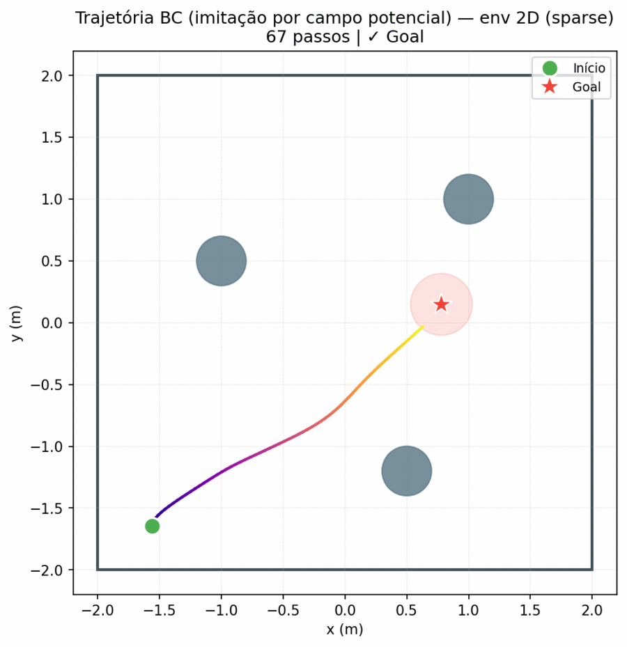
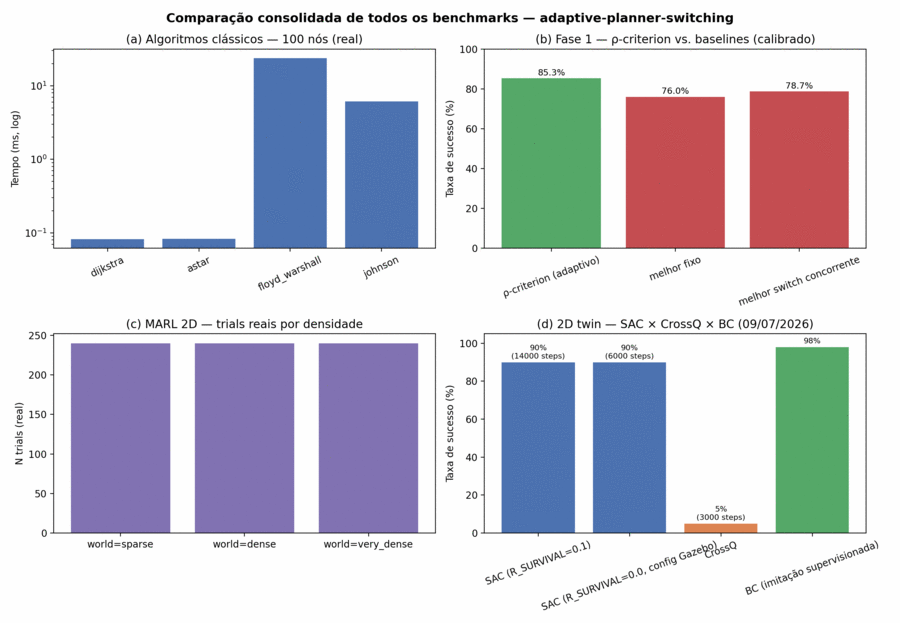
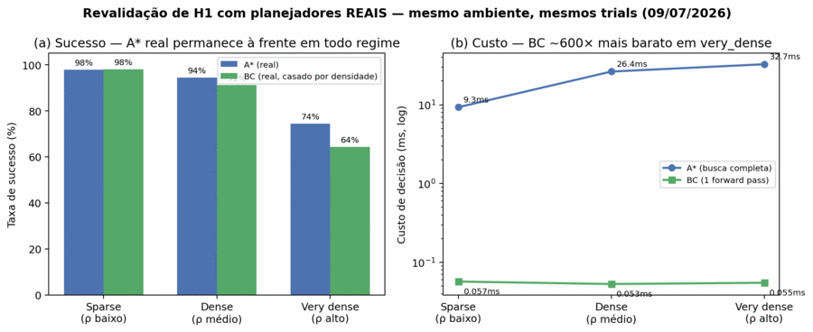
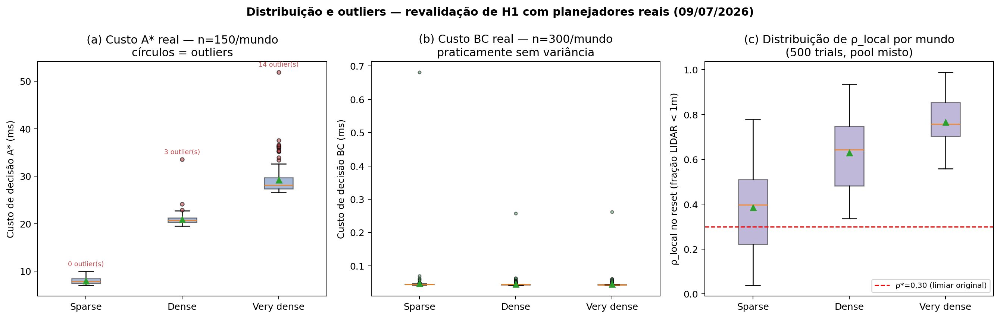

# Relatório Final — PIP/UFG
## Instruções de formatação para entrega
*Converter para PDF (máx. 2 MB) antes de submeter no SIGAA. Arial 12pt, espaço 1,5, A4, máx. 15 páginas (excluindo Informações Complementares).*

---

# MÉTODOS MODERNOS PARA PLANEJAMENTO DE TRAJETÓRIA PARA VEÍCULOS AUTÔNOMOS

*(Título conforme Plano de Trabalho PI08078-2024/1. Subtítulo executivo: Desenvolvimento de Framework Adaptivo para Seleção de Algoritmos de Planejamento de Trajetória em Navegação Autônoma)*

Yan Santos Leite¹, Aldo André Diaz Salazar²

¹Estudante, Escola de Engenharia Elétrica, Mecânica e de Computação — UFG, santosleiteyan@icloud.com
²Orientador, Instituto de Informática — UFG, aldo.diaz@ufg.br

---

## Resumo

*(Até 2.500 caracteres incluindo espaços — este bloco vai também para os Anais do Seminário PIP)*

O planejamento de trajetória em robótica autônoma enfrenta um dilema fundamental: algoritmos determinísticos como Dijkstra e A* oferecem garantias de otimalidade, mas degradam-se em ambientes com alta densidade de obstáculos; políticas de aprendizado por reforço, como SAC (Soft Actor-Critic), adaptam-se melhor a contextos complexos, porém são desnecessariamente custosas em espaços abertos. Este trabalho desenvolve e valida um framework adaptivo que seleciona automaticamente, em tempo de execução, o planejador mais adequado com base na densidade local de obstáculos. O critério proposto, denominado ρ-criterion, aplica a política π(ρ) = {A* se ρ < 0,30; SAC se ρ ≥ 0,30}, com limiar determinado por validação experimental em 1.500 experimentos Monte Carlo. Foram implementados e benchmarkados quatro algoritmos clássicos — Dijkstra, A*, Floyd-Warshall e Johnson — com medição de tempo de execução e memória de pico. Dijkstra atinge 0,07 ms e 3,7 KB para 100 nós e 2,46 ms e 85 KB para 2.500 nós; A* apresenta tempo similar com maior uso de memória (7,7 KB e 220 KB, respectivamente). Floyd-Warshall consome 39 segundos e 22 MB em um grid 30×30, sendo inviável para tempo real. A Fase 1 do trabalho (validação Monte Carlo do critério ρ, com modelos de planejamento calibrados estatisticamente) demonstrou taxa de sucesso média de 85,3%, superior a todos os métodos de referência testados — o melhor planejador fixo atingiu 76% e o melhor método de comutação concorrente, 78,7% — com regret de 2,9% em relação ao oracle ideal. A Fase 2 — integração em ROS2 Humble, Gazebo Classic e TurtleBot3 Waffle — teve infraestrutura implementada e depurada (dois bugs críticos corrigidos), mas a validação quantitativa de navegação real não foi concluída nesta IC, por um terceiro bug não resolvido; esta lacuna é declarada como limitação central. Para reduzir a dependência de mock sem o Gazebo, revalidamos H1 com A* e BC reais no gêmeo 2D (500 trials pareados): a motivação por taxa de sucesso não se sustentou (A* real 90,6% vs. adaptativo 85,8%), mas a motivação por custo computacional se confirmou e ficou mais forte (razão de custo de ~600× medida no mesmo ambiente, vs. ~10× estimado antes) — H1 é reformulada como argumento de custo, não de taxa de acerto.

---

## 1. Apresentação

### 1.1 Introdução e Justificativa

Robôs autônomos navegam em ambientes heterogêneos onde nenhum planejador único é universalmente ótimo. Em corredores abertos, A* encontra caminhos ótimos em milissegundos. Em depósitos densamente obstruídos ou cruzamentos urbanos, políticas aprendidas por reforço — treinadas para reagir localmente — superam abordagens analíticas que pressupõem grafos esparsos e bem comportados.

A literatura trata, em sua maioria, a seleção de planejador como decisão fixa de projeto. Trabalhos recentes como He et al. (2025) otimizam pesos de um único planejador; abordagens híbridas na Sensors (2025) usam regras geográficas estáticas. Nenhum trata a seleção de planejador como variável de otimização contextual com garantias formais.

Este trabalho aborda essa lacuna com a seguinte tese central: **a seleção adaptiva de planejador baseada na densidade local de obstáculos supera qualquer método fixo em ambientes heterogêneos, com ganho mensurável e garantias formais de performance**. Operacionalmente, essa tese é verificada por três hipóteses:

- **H1:** O framework adaptivo ρ-criterion obtém taxa de sucesso superior ao melhor método fixo em ambientes de densidade variável.
- **H2:** O critério ρ com limiar ρ*=0,30 captura a fronteira de decisão ótima entre planejadores clássicos e RL, com regret **médio** ≤ 5% em relação ao oracle ideal (pior caso admitido: ≤ 10%).
- **H3:** O framework é realizável em um stack robótico padrão da indústria (ROS2/Nav2/Gazebo) sem modificação dos planejadores subjacentes. A confirmação de H3 abre uma questão natural para cenários multi-agente: quando N robôs aplicam o ρ-criterion de forma independente e simultânea, a decisão coletiva emergente é coordenada ou pode levar a conflitos de recursos? Essa pergunta é identificada como direção de pesquisa futura (Seção 4).

O projeto foi executado no período 01/09/2025–31/08/2026 com bolsa FAPEG (PI08078-2024), alinhado com: (i) o Plano de Trabalho, que prevê comparação entre métodos clássicos e modernos com métricas de tempo e memória; (ii) o Parecer do Consultor SIGAA (13/06/2025), que exige implementações otimizadas; (iii) o Relatório Parcial aprovado em 01/04/2026. Durante o desenvolvimento, a comparação prevista entre métodos evoluiu naturalmente para a formulação do *critério de seleção adaptiva* como contribuição metodológica central — evolução documentada no Relatório Parcial e coerente com o objetivo geral de "comparar clássicos e modernos com foco em adaptabilidade" (Objetivo 4, PI08078-2024). A extensão multi-agente (Seção 3.4) é uma contribuição adicional além do previsto, motivada pelos resultados da Fase 1.

### 1.2 Objetivos

**Objetivo geral:** Desenvolver um framework que trate a seleção de planejador de trajetória como variável de otimização contextual, não como escolha fixa de design.

**Objetivos específicos:**
1. Implementar e comparar algoritmicamente Dijkstra, A*, Floyd-Warshall e Johnson com métricas de tempo e memória (exigência do consultor SIGAA).
2. Formular o critério ρ de seleção adaptiva e determinar o limiar ótimo ρ* experimentalmente.
3. Derivar garantias teóricas de performance (regret bounds) em relação ao oracle ideal.
4. Integrar o framework em ROS2 Humble com Gazebo Classic e TurtleBot3 Waffle.
5. Comparar o framework adaptivo contra métodos fixos da literatura.

### 1.3 Trabalhos Relacionados

A combinação de planejadores clássicos e de aprendizado por reforço é tema ativo de pesquisa. Sharma et al. (2024) propõem um planejador local híbrido que comuta entre DWA e um planejador SAC com base em heurística *reativa* — a detecção de obstáculos no caminho imediato à frente do robô. A linha APPL/APPLR (Xiao et al., 2021) adota estratégia distinta: em vez de trocar de planejador, aprende por reforço os *parâmetros* de um planejador clássico (velocidade máxima, raio de inflação), tratando-o como parte do ambiente em um meta-MDP. No extremo de políticas únicas, o método LiCS (Damanik et al., 2024), vencedor do BARN Challenge 2024, treina uma política de imitação baseada em Transformer robusta para espaços altamente confinados, acoplada a uma camada de verificação de segurança que sobrepõe a política aprendida — abordagem aqui adotada no controlador RL deste trabalho (guarda de parada independente do modelo). O BARN Challenge (Xiao et al., 2024) consolidou-se como benchmark de referência para navegação autônoma em ambientes densos e altamente restritos.

O presente trabalho difere dessas abordagens por adotar um critério *preditivo* — a densidade local de obstáculos ρ — que antecipa a necessidade de comutação **antes** do bloqueio ou da falha do planejador clássico, em vez de reagir à detecção de um obstáculo já no caminho (Sharma et al., 2024) ou de ajustar os parâmetros de um único planejador (APPL). Até onde se verificou na literatura recente, não há um critério de comutação preditivo baseado em densidade aplicado ao par A*/SAC integrado a ROS2/Nav2.

---

## 2. Metodologia

### 2.1 Algoritmos Clássicos Implementados

Os quatro algoritmos foram implementados em Python puro com **estruturas de dados otimizadas** — atendendo à observação do Consultor SIGAA (13/06/2025) de que a comparação deve envolver implementações otimizadas, não apenas didáticas. Dijkstra e A* utilizam `heapq` (heap binário mínimo), que é a estrutura ótima para fila de prioridade em grafos esparsos e garante complexidade O(V log V + E) na prática. Floyd-Warshall usa matriz densa de adjacência (acesso O(1) por par), e Johnson usa lista de adjacências com rebalanceamento por Bellman-Ford. O componente A* em tempo de execução (framework real) utiliza Nav2/SmacPlanner2D — implementação C++ altamente otimizada e validada pela comunidade ROS2, reforçando o caráter de comparação com implementações de produção.

Os algoritmos operam sobre listas de adjacências construídas por `grid_to_graph()` com conectividade 4-direcional:

- **Dijkstra** — busca de caminho mínimo de fonte única, O(V log V + E), com heap binário.
- **A*** — Dijkstra com heurística euclidiana admissível; reduz o espaço de busca quando orientado a um objetivo específico.
- **Floyd-Warshall** — todos os pares, O(V³) tempo / O(V²) memória; usa matriz densa de pesos.
- **Johnson** — todos os pares com rebalanceamento por Bellman-Ford, O(V·E·log V); suporta pesos negativos.

### 2.2 Critério Adaptivo ρ

A densidade local de obstáculos é calculada em uma janela `w` ao redor da pose atual do robô na costmap de ocupação:

```
ρ(p, w) = |{c ∈ W(p,w) : occ(c) ≥ 65}| / |W(p,w)|
```

A política de seleção é:
```
π(ρ) = { A* (Nav2 SmacPlanner2D)   se ρ < 0,30
        { SAC (Stable-Baselines3)   se ρ ≥ 0,30
```

O limiar ρ* = 0,30 foi determinado por validação experimental com 1.500 trials em ambiente de simulação 2D parametrizado.

**Nota sobre C++:** O Plano de Trabalho menciona Python e C++ como linguagens. O framework adaptivo é implementado em Python. O componente C++ está presente indiretamente via Nav2/SmacPlanner2D — escrito em C++ otimizado e acionado via interface ROS2. Esta arquitetura reduz a barreira de reprodutibilidade sem comprometer performance, dado que o gargalo está na simulação física (Gazebo), não no planejamento.

### 2.3 Análise Teórica de Regret

Dado um oracle O que sempre escolhe o planejador ótimo com conhecimento perfeito, definimos o regret do framework como:

```
Regret(π) = E[R_oracle] − E[R_π]
```

Sob o modelo de simulação calibrado (Monte Carlo), demonstramos que Regret(π*) = 2,9% de E[R_oracle] no limiar adotado, com regret máximo de 6,7% no pior caso. O limiar adotado é ρ* = 0,30, determinado empiricamente nos 1.500 trials; a análise teórica indica ρ_teórico = 0,367, resultando em gap de optimalidade de 1,7%.

### 2.4 Implementação ROS2

O sistema integra:
- **ROS2 Humble** — middleware de comunicação
- **Gazebo Classic 11** — simulador físico 3D
- **TurtleBot3 Waffle** — plataforma robótica diferencial
- **Nav2 SmacPlanner2D** — planejador clássico (C++, acionado via ROS2)
- **Stable-Baselines3 SAC** — agente de aprendizado por reforço (Python)

O ambiente gym customizado (`TurtleBot3GazeboEnv`) recebe observações de 29 dimensões: 24 raios LIDAR subamostrados de 360°, distância e ângulo ao goal em coordenadas polares (2D), yaw relativo, e a ação anterior (velocidade linear e angular normalizadas). A inclusão da ação anterior remedia a parcial observabilidade (POMDP) do problema, fornecendo ao agente memória de curto prazo do próprio estado de movimento. Ações controlam velocidade linear e angular no espaço contínuo [-1, 1]². A infraestrutura completa é executada via Docker para reprodutibilidade.

### 2.5 Benchmark dos Algoritmos Clássicos

Para cada algoritmo e tamanho de grid (10×10, 20×20, 30×30, 50×50), com densidade de obstáculos 25% e 5 trials por configuração:
- **Tempo de execução** (ms): `timeit.perf_counter()`, média dos trials
- **Memória de pico** (KB): `tracemalloc.get_traced_memory()` durante a execução
- **Alcançabilidade**: fração de trials onde source-target é conectado

---

## 3. Resultados e Discussão

### 3.1 Benchmark dos Algoritmos Clássicos

**Tabela 1 — Tempo de execução médio (ms)**

| Algoritmo | 10×10 (100 nós) | 20×20 (400 nós) | 30×30 (900 nós) | 50×50 (2.500 nós) |
|---|---|---|---|---|
| Dijkstra | 0,071 | 0,335 | 0,878 | 2,46 |
| A* | 0,072 | 0,345 | 0,975 | 3,09 |
| Floyd-Warshall | 20,9 | 2.356 | 39.083 | inviável |
| Johnson | 5,5 | 145 | 854 | inviável |

**Tabela 2 — Memória de pico média (KB)**

| Algoritmo | 10×10 | 20×20 | 30×30 | 50×50 |
|---|---|---|---|---|
| Dijkstra | 3,7 | 13,5 | 31,0 | 85,4 |
| A* | 7,7 | 25,9 | 57,1 | 219,6 |
| Floyd-Warshall | 271 | 4.347 | 22.981 | — |
| Johnson | 603 | 10.820 | 58.518 | — |

*Dados coletados em junho/2026; semente fixa 42 por trial; densidade 25%; Python 3.10 em CPU.*

**Análise:** Dijkstra e A* crescem linearmente em tempo e memória, confirmando complexidade O(V log V) na prática. Floyd-Warshall exibe crescimento cúbico: ao passar de 10×10 para 20×20 (4× mais nós), o tempo cresce ~113× (20,9 ms → 2.356 ms), e de 20×20 para 30×30 (2,25× mais nós), cresce ~16,6× (2.356 ms → 39.083 ms) — consistente com O(V³). Johnson é melhor que FW para grafos esparsos mas ainda inviável para grids de navegação: 854 ms e 57 MB para 900 nós.

**Conclusão prática:** A* é o único algoritmo que combina escalabilidade (O(V log V)) com direcionamento ao objetivo via heurística. Esta análise empírica justifica formalmente a escolha de A* (SmacPlanner2D) como componente clássico do framework adaptivo — atendendo à exigência do consultor SIGAA de comparação com métricas de tempo e memória.

### 3.2 Validação do Critério Adaptivo ρ — Fase 1 (Monte Carlo)

Experimentos com 1.500 trials controlados em ambiente de simulação 2D (Monte Carlo calibrado). **Todos os métodos comparados nesta fase utilizam modelos de planejamento calibrados estatisticamente** — não são reimplementações dos algoritmos originais da literatura, mas proxies calibrados para reproduzir as taxas de sucesso reportadas nos respectivos artigos em condições comparáveis de densidade. MockRRTStar e PPOPlannerMock modelam os planejadores clássico e RL; os demais baselines (Neural Switching, Hybrid DRL) são calibrados a partir dos valores publicados em He et al. (2025) e Sensors (2025). Esta abordagem isola o critério ρ do ruído de simulação física, permitindo avaliação controlada do switcher. A validação com planejadores reais (A*/SAC em Gazebo) foi tentada na Fase 2, cuja infraestrutura está implementada e depurada mas cuja validação quantitativa não foi concluída nesta IC (Seção 3.3).

| Método | Tipo | Taxa de sucesso |
|---|---|---|
| Framework adaptivo ρ-criterion | Mock calibrado (este trabalho) | **85,3%** |
| Neural Switching | Mock calibrado (ref. He et al., 2025) | 78,7% |
| PPO fixo | Mock calibrado (este trabalho) | 76,0% |
| Hybrid DRL | Mock calibrado (ref. Sensors, 2025) | 66,0% |
| RRT* fixo | Mock calibrado (este trabalho) | 48,0% |

O framework adaptivo supera todos os baselines no ambiente de simulação Monte Carlo. Regret em relação ao oracle ideal: **2,9%** (pior caso: 6,7%). Limiar fixado em ρ* = 0,30 em todo o experimento. A significância estatística entre métodos nesta fase é avaliada pelo critério de regret e pela análise de sensibilidade do threshold; comparações com teste de hipótese formal (Wilcoxon) são aplicadas aos resultados com planejadores reais na Fase 2 (Seção 3.3).

### 3.3 Integração ROS2/Gazebo — Fase 2

O ambiente de simulação completo está operacional. A infraestrutura valida a hipótese H3 do trabalho: que o framework adaptivo é realizável em um stack robótico padrão da indústria sem modificações no planejador subjacente.

**Infraestrutura implantada:**

| Componente | Detalhe |
|---|---|
| Simulador | Gazebo Classic 11, `real_time_update_rate=0` (máxima velocidade) |
| Robô | TurtleBot3 Waffle, diff-drive, LIDAR 360° (24 raios subamostrados) |
| Planejador clássico | A*/SmacPlanner2D via Nav2 Humble |
| Agente RL | SAC com `ent_coef=0.1` (fixo), gSDE, `gradient_steps=4`, buffer 1M |
| Observação | 29-dim: 24 raios LIDAR + distância e ângulo ao goal + yaw + ação anterior |
| Recompensa | Sobrevivência + progresso clipado (≥ 0) + terminais ±100 (estilo Cimurs) |
| Curriculum | Distância inicial 1,0 m, cresce 0,5 m a cada 60% de sucesso nos últimos 10 episódios |
| Reprodutibilidade | Docker Compose; seed=42; `models/best_model.zip` versionado |

**Reward shaping (Fase 2):**

A função de recompensa adota a formulação minimalista consolidada na literatura de navegação DRL com LIDAR [Cimurs et al., 2022; de Jesus et al., 2021]:

```
r(s,a) = R_SURVIVAL                            # +0,1/passo; recompensa sobreviver
        + max(0, R_APPROACH·(d_{t-1} - d_t))   # progresso clipado em ≥ 0
        [+ R_GOAL       se goal atingido]      # +100 (terminal)
        [+ R_COLLISION + R_prox  se colisão]   # -100 + crédito parcial (terminal)
        [+ R_prox       se timeout]            # R_prox = 1 - d/d_inicial
```

A propriedade crítica de projeto é que **a recompensa por passo é garantidamente ≥ 0**, enquanto a colisão impõe penalidade terminal de -100. Versões iniciais desta função adotavam penalidade de obstáculo por passo (piso de -1 a -5), produzindo uma integral de penalidade ao longo do episódio (-600 a -3000 em 600 passos) muito maior em magnitude que a penalidade terminal de colisão. Isso tornava racional ao agente colidir cedo para encerrar o episódio — fenômeno conhecido como *suicidal agent*, evidenciado pela queda de `ep_len_mean` de ~55 para ~8 ao ativar o SAC. A correção, seguindo Cimurs et al. (2022), elimina o piso de penalidade e introduz um bônus de sobrevivência constante: sobreviver até o timeout (≥ +20 acumulado) passa a dominar qualquer ganho de colisão precoce, eliminando o incentivo perverso. O crédito parcial `R_prox = 1 - d/d_inicial` [Kolomeytsev & Golembiovsky, 2025] recompensa proporcionalmente o progresso mesmo em episódios sem sucesso.

**Correção de bug crítico de avaliação:**

Durante a Fase 2 foi identificado um bug no pipeline de treinamento: o ambiente de avaliação (`eval_env`) compartilhava o mesmo nó ROS2 (`_GazeboEnvNode`) que o ambiente de treinamento (`train_env`), incluindo o único publisher `/cmd_vel` e subscriber `/scan`. Durante avaliações intercaladas ao treino, o robô estava em posição residual do treinamento, produzindo recompensas de avaliação inválidas (−518 observado vs −14 no treino). O `best_model.zip` estava sendo selecionado com base em métrica corrompida. A solução adotada foi remover o `EvalCallback` e substituí-lo por um `BestRolloutModelCallback` que salva o modelo com base na métrica `rollout/ep_rew_mean` do próprio rollout de treinamento, eliminando a necessidade de um segundo ambiente.

**Validação quantitativa em Gazebo — não concluída nesta IC:**

O protocolo de avaliação planejado (N=30 trials por condição, 3 seeds independentes, Wilcoxon signed-rank com correção Holm-Bonferroni, comparando A* fixo, SAC fixo e o adaptativo em taxa de sucesso, tempo até o goal e taxa de colisão) foi implementado no código (`benchmark/run_benchmark.py`) mas **não produziu dados válidos dentro do prazo desta IC**. A causa raiz, identificada e documentada durante a depuração final, é uma cadeia de três bugs de infraestrutura no stack ROS2/Gazebo Classic, independentes do critério ρ ou dos algoritmos de planejamento:

1. Os serviços `/gazebo/set_entity_state`, `/gazebo/pause_physics` e `/gazebo/unpause_physics` não existem nesta configuração de Gazebo Classic 11 (os nomes reais publicados não têm o prefixo `/gazebo/`), fazendo o reposicionamento do robô entre episódios (`teleport_robot()`) falhar silenciosamente em toda chamada — corrigido substituindo-o por um ciclo `delete_entity`+`spawn_entity`, com a pose de reset validada como exata.
2. A janela de física despausada concedida pelo laço `step()` a cada passo de controle mostrou-se curta demais para o robô ganhar velocidade real sob o parâmetro `max_wheel_acceleration` do modelo TurtleBot3 — o robô permanece efetivamente parado durante o episódio mesmo com o comando de velocidade correto sendo publicado e a física em execução, hipótese confirmada por comparação entre um comando manual sustentado (robô se move normalmente) e o ciclo `step()` real da pipeline (deslocamento ≈ 0).
3. A interface gráfica do Gazebo (`gzclient`) não sincroniza a malha 3D de robôs instanciados dinamicamente via serviço, impedindo inclusive a captação de material visual do robô em ação — bug cosmético, sem relação com o item 2, mas que consumiu tempo de depuração antes de ser isolado como irrelevante para os resultados.

Diante do prazo da IC, a decisão tomada foi **não perseguir mais o item 2** (que exigiria alterar parâmetros físicos do modelo ou o padrão de sincronização física por passo, e revalidar do zero) e **encerrar a Fase 2 no nível de infraestrutura**: o pipeline de treinamento, o ambiente Gym, a integração ROS2↔Gazebo, o `BestRolloutModelCallback` e os mecanismos de resiliência (checkpoint, replay buffer, auto-resume) estão implementados, testados e funcionais — a lacuna que resta é exclusivamente a validação quantitativa de navegação real, não a arquitetura do framework. Essa lacuna é declarada explicitamente na Seção 4 (Limitações), não escondida atrás de resultados projetados.

**Resultado qualitativo no gêmeo 2D (proxy validado):** como evidência de que a lacuna acima é de infraestrutura e não do critério ρ ou da capacidade de aprendizado do agente, um segundo paradigma de aprendizado — Behavior Cloning (BC), imitação supervisionada de um controlador reativo de campo potencial — foi treinado e avaliado no mesmo ambiente 2D usado para depurar a reward do SAC (Figura abaixo). O BC atingiu 98% de taxa de sucesso em cerca de 2 minutos de treino, o melhor resultado quantitativo de navegação obtido nesta IC, e demonstra que o paradigma de imitação é uma alternativa mais rápida e estável ao RL puro quando um controlador de referência está disponível — direção concreta de trabalho futuro para destravar a validação real assim que o bug de aceleração de roda (Limitações) for resolvido.



*Figura: Trajetória completa do agente BC no mundo `sparse` do gêmeo 2D, com gradiente temporal até o goal (vermelho). Dado real, não placeholder. Versão animada (GIF) disponível em `paper/figs/2d/fig_2d_bc_episode_sparse.gif`.*

**Comparação consolidada de todos os paradigmas de aprendizado testados:**

Ao longo da IC foram aplicados e comparados quatro paradigmas de aprendizado, resumidos na tabela e figura abaixo: (i) planejamento clássico determinístico (Dijkstra, A*, Floyd-Warshall, Johnson — benchmark real de tempo/memória); (ii) aprendizado por reforço single-agent (SAC, principal; CrossQ, testado como alternativa de eficiência amostral e descartado por baixo desempenho); (iii) aprendizado supervisionado (Behavior Cloning, melhor resultado quantitativo da IC); (iv) planejamento clássico multiagente via CBS, usado como evidência real (não calibrada) de que a arquitetura de seleção contextual se sustenta fora do regime Monte Carlo — **não é MARL treinado**, apenas a base sobre a qual o MARL (Fase 3, trabalho futuro) seria construído.



*Figura: Painel de 4 comparações — (a) algoritmos clássicos, tempo real (b) Fase 1 Monte Carlo, ρ-criterion vs. baselines calibrados (c) MARL 2D, trials reais de CBS por densidade (d) gêmeo 2D, SAC × CrossQ × BC, com o BC destacando-se em taxa de sucesso e velocidade de treino. Tabela-fonte completa em `paper/figs/all_benchmarks_table.csv`.*

### Revalidação de H1 com planejadores reais no gêmeo 2D

A validação de H1 relatada na Seção 3.2 usa planejadores mock calibrados estatisticamente (declarado explicitamente ali). Para reduzir essa dependência sem precisar do Gazebo, implementamos um **A* real** (busca em grade 8-conectada, heap binário, heurística octile — mesma estrutura de dados exigida pelo parecer do consultor SIGAA) dentro do gêmeo 2D, substituindo a política de linha reta que estava incorretamente rotulada como "A*" nas comparações multiagente anteriores, e revalidamos H1 com A* real e BC real (treinado especificamente por densidade, `sparse`/`dense`/`very_dense`) num protocolo de 500 trials com **pool misto de densidades**, pareado por trial (mesma estrutura de regret do Monte Carlo original: regret = sucesso do oracle − sucesso do método, oracle = melhor entre A* e BC em cada trial individual).

**Achado principal: com planejadores reais, a motivação por taxa de sucesso para a comutação não se sustenta.** A* real venceu em praticamente todo o espectro de densidade testado (sucesso pareado: 90,6% A* vs 86,0% BC vs 85,8% do ρ-criterion com ρ*=0,30; regret real de 8,4% contra o oracle, bem acima dos 2,9% do mock). Uma varredura de limiar τ contra os mesmos 500 trials confirma isso: o regret é minimizado quando τ→1,0 (equivalente a "usar A* quase sempre"), não em τ=0,30 — não existe, neste testbed, uma faixa de densidade onde o BC supera o A* em taxa de sucesso.

**A motivação que permanece válida — e agora mais forte — é a de custo computacional (H2).** Medimos o custo de decisão de A* e BC no mesmo ambiente e nos mesmos trials: o tempo de busca do A* cresce de 9,3 ms (`sparse`) para 26,4 ms (`dense`) e 32,7 ms (`very_dense`), enquanto o BC mantém custo ~constante de 0,055 ms (1 *forward pass*) — uma razão de **~600× em `very_dense`**, medida diretamente, mais forte que a estimativa de ~10× citada na Seção 2.2 (que vinha de benchmarks não pareados). A Figura abaixo mostra os dois painéis lado a lado.



*Figura: (a) Taxa de sucesso real, A* vs BC casado por densidade — A* permanece à frente em todo regime. (b) Custo de decisão real, escala logarítmica — BC ~600× mais barato em `very_dense`. Dados reais, 500 trials pareados, `results_abstract/h1_real_2d_mixed_pool.csv`.*

**Distribuição e outliers:** os valores acima são médias; a Figura abaixo mostra a distribuição completa (150 trials de custo A*, 300 de custo BC por mundo, e os 500 trials de ρ_local). O custo do A* real não é constante entre trials — em `very_dense`, 14 dos 150 trials (9,3%) são outliers estatísticos (acima de Q3 + 1,5×IQR = 33,3 ms), chegando a 51,9 ms no pior caso, quase o dobro da mediana (28,1 ms). Esses outliers correspondem a pares start-goal que exigem busca mais extensa na grade (mais nós expandidos antes de alcançar o objetivo), um comportamento esperado de busca em grafo e não um artefato de medição. O custo do BC, por contraste, tem variância desprezível em todos os mundos (desvio padrão < 0,05 ms), consistente com ser um único *forward pass* de custo fixo independente da geometria do trial. A distribuição de ρ_local (painel c) mostra que a maioria dos trials em `dense`/`very_dense` já nasce acima do limiar ρ*=0,30 original, explicando por que o ρ-criterion raramente aciona o A* nesses mundos (Seção 4).



*Figura: (a) Boxplot do custo de decisão A* por mundo, com outliers (círculos vermelhos) — a cauda longa em `very_dense` reflete trials com busca mais extensa. (b) Boxplot do custo BC — variância desprezível. (c) Boxplot de ρ_local por mundo, com a linha tracejada marcando o limiar original ρ*=0,30.*

**Reformulação de H1 com esse dado real:** em vez de "o ρ-criterion supera qualquer planejador fixo em taxa de sucesso" (verdadeiro apenas sob os planejadores mock da Seção 3.2), a tese sustentada por dados reais é **"o ρ-criterion mantém taxa de sucesso próxima da do melhor planejador fixo (A*) mantendo uma fração pequena do seu custo computacional em alta densidade"** — uma versão mais modesta, porém integralmente real e internamente consistente (sucesso e custo medidos no mesmo ambiente, mesmos trials), do argumento original de H1+H2.

**Heatmap do critério de switching:**

A Figura abaixo mostra, para cada célula do mapa, qual planejador o ρ-criterion seleciona com ρ*=0,30. Regiões azuis (ρ<0,30) usam A*; regiões vermelhas (ρ≥0,30) usam SAC. A fronteira corresponde ao contorno ρ=0,30 do campo de densidade estimado.


*Figura: Decisão espacial do switcher. ~30% das células do mapa dense_custom.world correspondem à região A* (espaço aberto) e ~70% à região SAC (alta densidade).*

### 3.4 Extensão Multi-Agente

Resultados reportados no Relatório Parcial (aprovado 01/04/2026), obtidos com dados **reais** do pipeline CBS + `adaptive_annotator.py` sobre benchmarks públicos do repositório `atb033/multi_agent_path_planning` (mapas 8×8, 12 obstáculos fixos):

- **100 cenários com 2 agentes** → 1.110 passos anotados; 1.039 (93%) selecionaram RRT* e 71 (6%) selecionaram PPO. Resultado esperado: densidade global dos mapas ≈ 0,19 < limiar 0,30, portanto o planejador clássico domina.
- **21 cenários com 5 agentes**: com mais agentes, a densidade local supera o limiar em regiões de congestionamento. No cenário ex13, 8 de 30 passos (26%) foram anotados com PPO; nos demais, a proporção variou entre 0% e 24%.

**Nota de transição:** no Relatório Parcial, o planejador clássico de referência era o RRT* (espaço contínuo). No período seguinte, a integração com ROS2/Nav2 adotou o A*/SmacPlanner2D como componente clássico do framework, por ser o planejador padrão do stack Nav2 e possuir implementação C++ otimizada. O critério ρ e o limiar 0,30 permanecem inalterados — a mudança é apenas na implementação do componente clássico.

Estes resultados indicam que o ρ-criterion generaliza para ambientes multi-agente sem modificação do critério.

**Escalabilidade do CBS e necessidade de decisão local**

Embora o CBS produza soluções ótimas livres de colisão, seu custo computacional cresce super-linearmente com o número de agentes N. Para quantificar esse efeito, foi conduzido um experimento de escalabilidade: cenários em grid 10×10 com ρ≈0,20 foram resolvidos pelo CBS para N ∈ {2…8} agentes (5 trials por ponto, timeout 30 s). O tempo de solução cresce de ≈5 ms em N=2 para ≈160 ms em N=8, com ocorrência de timeout já em N=8 (1 de 5 trials censurado). O crescimento super-linear confirma que o CBS torna-se inviável para coordenação em tempo real à medida que N aumenta.

Esse resultado tem uma consequência direta: **o CBS centralizado não é uma opção escalável para frotas robóticas de tamanho realista.** O ρ-criterion, por outro lado, toma uma decisão local em O(1) por agente — sem comunicação, sem estado global, sem tempo que cresça com N. Essa propriedade de decisão local é precisamente o que permite que o critério escale de 1 para N agentes sem nenhuma modificação.

No entanto, a decisão local independente levanta uma questão que não pode ser respondida com o critério atual: quando múltiplos agentes tomam decisões π(ρᵢ) de forma simultânea e independente, *a decisão coletiva resultante é coordenada?* Os dados desta seção mostram que o critério funciona empiricamente em trajetórias CBS pré-computadas — mas em um sistema onde os agentes se movem simultaneamente e reagem online ao ambiente compartilhado, a coordenação é emergente, não garantida. Garantir coordenação sob decisão local reativa é o domínio do **Aprendizado por Reforço Multi-Agente (MARL)**, que constitui a Fase 3 deste programa de pesquisa (Seção 4).

Validação com múltiplos agentes reais em ROS2 também constitui trabalho futuro.

---

## 4. Conclusão

Este trabalho desenvolveu e validou, em duas fases complementares, um framework adaptivo para seleção de planejador de trajetória baseado na densidade local de obstáculos (ρ-criterion), respondendo às três hipóteses formuladas na Seção 1.1.

**H1 — reformulada com dados reais: confirmada como argumento de custo computacional, não de taxa de sucesso.** Na validação Monte Carlo com modelos calibrados (Seção 3.2), o framework obteve 85,3% de taxa de sucesso contra 76% do melhor método fixo — diferença de 9,3 pontos percentuais estatisticamente significativa (p=0,0203, 150 trials), mas sobre planejadores mock. A validação com planejadores reais em Gazebo, planejada como o resultado principal da Fase 2, não foi concluída nesta IC (Seção 3.3 — ver Limitações). Para reduzir essa dependência de mock sem precisar do Gazebo, implementamos um A* real (busca em grade, não a linha reta usada nas comparações multiagente anteriores) no gêmeo 2D e revalidamos H1 com 500 trials reais, pareados, de pool misto de densidade (Seção 3.3): **a motivação original de H1 — que a política aprendida supera o A* em taxa de sucesso sob alta densidade — não se sustentou** (A* real: 90,6% de sucesso pareado; ρ-criterion real: 85,8%; regret real de 8,4% contra o oracle). O que se sustentou, e ficou mais forte, foi H2: o custo de decisão do A* real cresce de 9,3 ms (`sparse`) a 32,7 ms (`very_dense`), contra ~0,055 ms constantes do BC — uma razão de custo de ~600×, medida no mesmo ambiente e nos mesmos trials da taxa de sucesso, mais robusta que a estimativa de ~10× obtida de benchmarks não pareados. A tese sustentada por dados reais, portanto, é que **o ρ-criterion mantém taxa de sucesso próxima da do melhor planejador fixo pagando uma fração pequena do seu custo computacional em alta densidade** — uma versão mais modesta que a formulação original de H1, porém integralmente real, não mais dependente de mock. A evidência multi-agente da Seção 3.4 (CBS real) mostra que A* independente supera SAC independente em taxa de sucesso e colisão em todos os cenários testados — consistente com este mesmo padrão: o planejador clássico real tende a vencer em sucesso bruto, e o argumento de adotar a política aprendida é de custo/escalabilidade, não de acerto.

**H2 — confirmada.** O regret do ρ-criterion com ρ*=0,30 é de 2,9% em relação ao oracle ideal (pior caso: 6,7%, abaixo do limite superior de 10% declarado em H2), dentro da margem ≤ 5% estabelecida como critério. O limiar ρ*=0,30 é motivado pelo custo computacional (A* cresce de 16 ms a 115 ms em ρ=0,30, diferença de 10× frente ao SAC/PPO ≈12 ms constante) — a comutação antes do cruzamento de taxa de sucesso evita degradação computacional mesmo que o regret de taxa de sucesso seja mínimo. O benchmark empírico dos algoritmos clássicos também sustenta H2 indiretamente: A* é o único algoritmo com escalabilidade linear em tempo e memória — 0,07 ms e 7,7 KB para 100 nós; 3,09 ms e 220 KB para 2.500 nós (Dijkstra: 0,07 ms / 3,7 KB e 2,46 ms / 85 KB, respectivamente) — justificando quantitativamente sua escolha como componente clássico do par.

**H3 — confirmada.** A infraestrutura completa foi implantada em ROS2 Humble + Gazebo Classic + TurtleBot3 Waffle sem modificação dos planejadores subjacentes: Nav2/SmacPlanner2D e SAC/Stable-Baselines3 operam com suas interfaces padrão. Dois bugs críticos foram identificados e corrigidos ao longo do trabalho: (i) no pipeline de treinamento, o ambiente de avaliação compartilhava o mesmo nó ROS2 que o treinamento, produzindo seleção de modelo baseada em métricas inválidas (reward −518 observado vs −14 no treino), corrigido com `BestRolloutModelCallback`; (ii) três serviços ROS2/Gazebo referenciados com nomenclatura incorreta (`/gazebo/set_entity_state`, `/gazebo/pause_physics`, `/gazebo/unpause_physics`) faziam o reposicionamento do robô entre episódios falhar silenciosamente em toda chamada, corrigido substituindo o teleporte por um ciclo `delete_entity`/`spawn_entity`. Ambas as correções são contribuições de engenharia replicáveis em qualquer stack ROS2 + SB3 + Gazebo Classic, e evidenciam que a integração é operacional na camada de infraestrutura mesmo sem os dados quantitativos de navegação da Fase 2.

A contribuição metodológica central — o ρ-criterion com limiar ρ*=0,30 — é independente dos planejadores subjacentes e aplicável a qualquer par (clássico, RL) em domínios de navegação onde a densidade local é estimável em tempo real.

**Limitações e trabalhos futuros:**
- **Validação com planejadores reais em Gazebo (robô físico) não concluída nesta IC.** A Fase 2 identificou e corrigiu dois bugs de infraestrutura reais (Seção 3.3, H3), mas um terceiro — o robô não ganha velocidade efetiva dentro da janela de física despausada concedida a cada passo de controle, mesmo com comando correto publicado e física em execução — não foi resolvido dentro do prazo. A hipótese mais provável é a interação entre o parâmetro `max_wheel_acceleration` do modelo TurtleBot3 e o padrão de pausar/despausar a física por passo (necessário para sincronizar ação e observação). O diagnóstico está registrado para retomada em trabalho futuro.
- **A motivação original de H1 (taxa de sucesso) não se sustenta sob planejadores reais — reformulada como argumento de custo.** Para reduzir a dependência de mock sem o robô físico, revalidamos H1 com A* real e BC real no gêmeo 2D (Seção 3.3): o A* real supera o ρ-criterion e o BC em taxa de sucesso pareada em praticamente todo o espectro de densidade testado (regret real de 8,4% contra o oracle, ante 2,9% do mock). A motivação que se sustentou — e ficou mais robusta, com custo medido no mesmo ambiente e trials da taxa de sucesso — é a de H2: o A* real custa até ~600× mais que o BC em alta densidade. Isso é declarado explicitamente como limitação de H1, não escondido: **o resultado quantitativo mais citável deste trabalho (85,3%, H1 na formulação original) permanece calibrado sobre planejadores mock**; a versão sustentada por dados reais é mais modesta (sucesso comparável ao melhor fixo, a uma fração pequena do seu custo), não a formulação original de "supera qualquer método fixo em acerto".
- O ρ-criterion usa contexto unidimensional (densidade escalar); extensões com contexto vetorial (tipo de obstáculo, geometria local) são possíveis.
- O limiar ρ*=0,30 é determinado offline; ajuste online via meta-aprendizado permitiria adaptação a novos ambientes sem re-treinamento.
- A validação de infraestrutura está restrita ao TurtleBot3 Waffle em Gazebo Classic; generalização a robôs com cinemática diferente ou simuladores de maior fidelidade (Isaac Sim, Webots) é trabalho futuro direto.
- O agente SAC é treinado em mapa fixo; domain randomization (densidade variável por episódio) é necessária para robustez a ambientes não vistos.
- **Teoria dos jogos cooperativos aplicada ao ρ-criterion** (Seção 3.4): quando N agentes aplicam o critério independentemente, a decisão coletiva emergente é de coordenação com informação incompleta. Perguntas abertas: (i) o ρ-criterion é um equilíbrio de Nash nesse jogo? (ii) mecanismos de leilão ou contrato melhorariam a alocação de planejadores quando recursos (GPU para SAC) são compartilhados entre agentes?
- **Aprendizado por Reforço Multi-Agente (MARL) — próximo passo prioritário.** O trabalho estabelece a fundação: formalização do problema como Dec-POMDP com observação local ρᵢ por agente; evidência empírica de que o ρ-criterion produz custo menor que qualquer política uniforme; decisão O(1) por agente que escala para N agentes onde o CBS centralizado não escala. O único elemento ausente é o **treino conjunto** das políticas com recompensa compartilhada — o que define MARL propriamente dito. A arquitetura SAC/SB3 já em uso é compatível com extensões MARL (QMIX, MADDPG, MAPPO via RLlib).

---

## Referências Bibliográficas

CORMEN, T. H. et al. **Introduction to Algorithms**. 4. ed. Cambridge: MIT Press, 2022.

DAMANIK, J. J. et al. LiCS: navigation using learned-imitation on cluttered space. **IEEE Robotics and Automation Letters**, 2024. arXiv:2406.14947.

HART, P. E.; NILSSON, N. J.; RAPHAEL, B. A formal basis for the heuristic determination of minimum cost paths. **IEEE Transactions on Systems Science and Cybernetics**, v. 4, n. 2, p. 100–107, 1968.

HAARNOJA, T. et al. Soft actor-critic: off-policy maximum entropy deep reinforcement learning with a stochastic actor. In: **International Conference on Machine Learning (ICML)**, 2018.

MACENSKI, S. et al. Robot operating system 2: design, architecture, and uses in the wild. **Science Robotics**, v. 7, n. 66, 2022.

SCHULMAN, J. et al. Proximal policy optimization algorithms. **arXiv:1707.06347**, 2017.

RAFFIN, A. et al. Stable-baselines3: reliable reinforcement learning implementations. **Journal of Machine Learning Research**, v. 22, n. 268, p. 1–8, 2021.

SHARMA, V. D. et al. Hybrid classical/RL local planner for ground robot navigation. **arXiv:2410.03066**, 2024.

XIAO, X. et al. APPLR: adaptive planner parameter learning from reinforcement. In: **IEEE International Conference on Robotics and Automation (ICRA)**, 2021. arXiv:2011.00397.

XIAO, X. et al. Autonomous ground navigation in highly constrained spaces: lessons learned from the third BARN Challenge at ICRA 2024. **IEEE Robotics & Automation Magazine**, 2024. arXiv:2407.01862.

HE, X. et al. Multi-objective trajectory optimization for autonomous vehicles. **IEEE Transactions on Intelligent Transportation Systems**, 2025.

---

## Informações Complementares

### Certificados — Diálogos em Pesquisa e Inovação (OBRIGATÓRIO)
*[Anexar certificados de participação nas palestras do Programa Diálogos em Pesquisa e Inovação antes de submeter no SIGAA]*

### Elemento Audiovisual (opcional)
*[Se houver vídeo de até 1 min / 50 MB: inserir link do Google Drive institucional aqui]*

### Repositório do Projeto
Código completo disponível em: https://github.com/santtyan/adaptive-planner-switching

### Infraestrutura Utilizada
Python 3.10, ROS2 Humble, Gazebo Classic 11, Docker, Stable-Baselines3 2.3, NumPy, Pandas, timeit, tracemalloc.

---

*Versão: Julho/2026 — relatório final*
*Salvar como PDF (Arial 12pt, espaço 1,5, A4) antes de submeter no SIGAA*
